# Laporan Praktikum #10 - POLIMORFISME

## Kompetensi

Setelah menyelesaikan lembar kerja ini mahasiswa diharapkan mampu:
1. Menjelaskan maksud dan tujuan penggunaan Abstract Class;
2. Menjelaskan maksud dan tujuan penggunaan Interface;
3. Menerapkan Abstract Class dan Interface di dalam pembuatan program.Setelah melakukan percobaan pada jobsheet ini, diharapkan mahasiswa
mampu:
a. Memahami konsep dan bentuk dasar polimorfisme
b. Memahami konsep virtual method invication
c. Menerapkan polimorfisme pada pembuatan heterogeneous collection
d. Menerapkan polimorfisme pada parameter/argument method
e. Menerapkan object casting untuk meng-ubah bentuk objek

## Ringkasan Materi

Polimorfisme merupakan kemampuan suatu objek untuk memiliki banyak bentuk.

## Percobaan 1

1. Buat class Employee
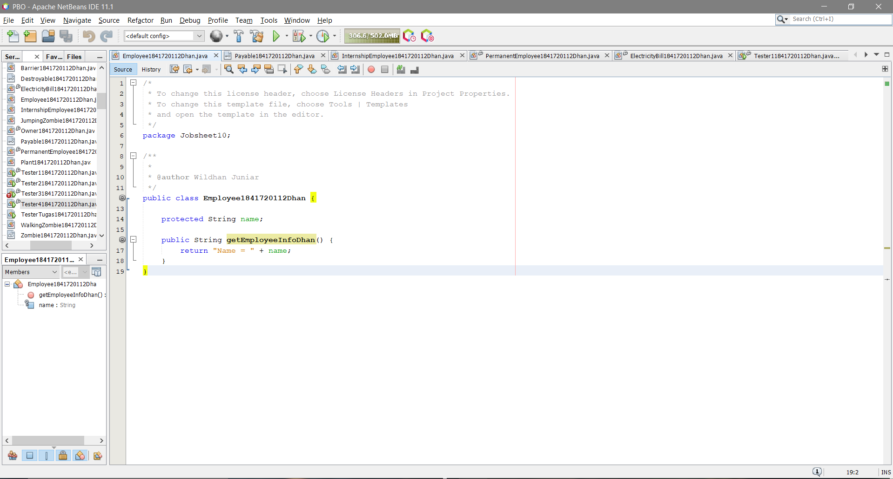

Link kode program : [ini link ke kode program](../../src/10_Polimorfisme/Employee1841720112Dhan.java)

2. Buat interface Payable
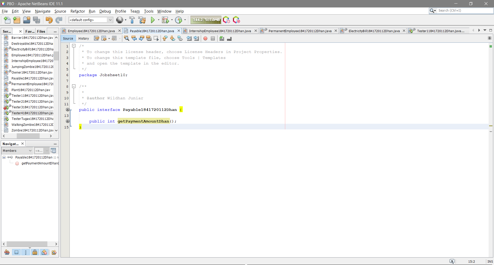

Link kode program : [ini link ke kode program](../../src/10_Polimorfisme/Payable1841720112Dhan.java)

3. Buat class InternshipEmployee, subclass dari Employee
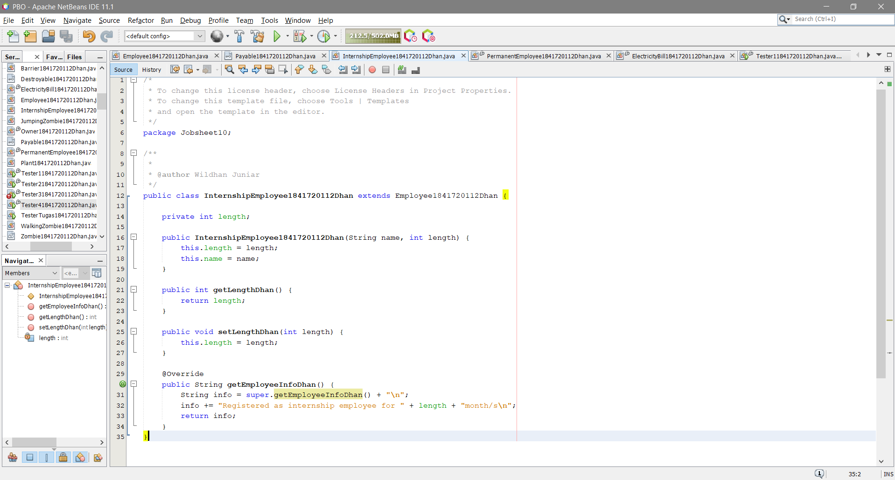

Link kode program : [ini link ke kode program](../../src/10_Polimorfisme/InternshipEmployee1841720112Dhan.java)

4. Buat class PermanentEmployee, subclass dari Employee dan implements ke Payable
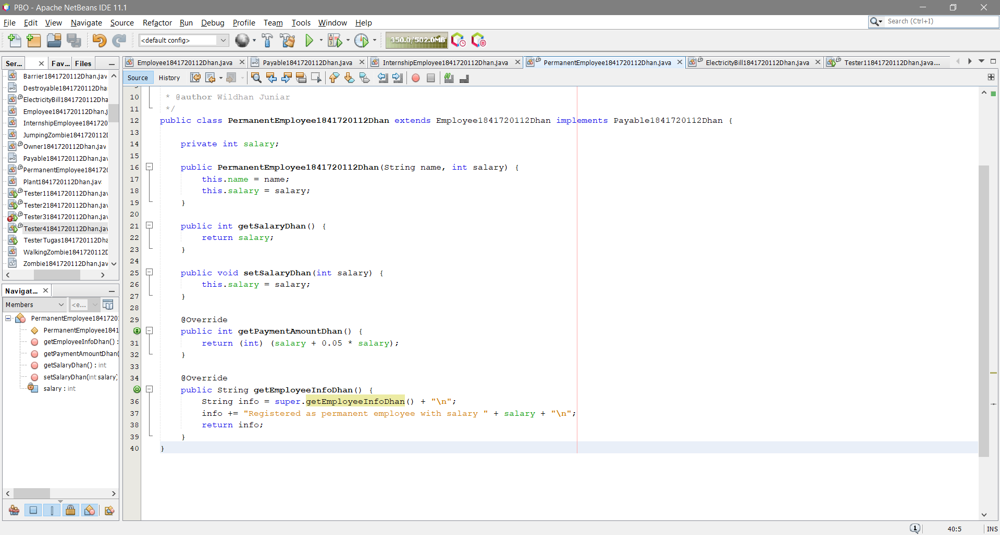

Link kode program : [ini link ke kode program](../../src/10_Polimorfisme/PermanentEmployee1841720112Dhan.java)

5. Buat class ElectricityBill yang implements ke interface Payable
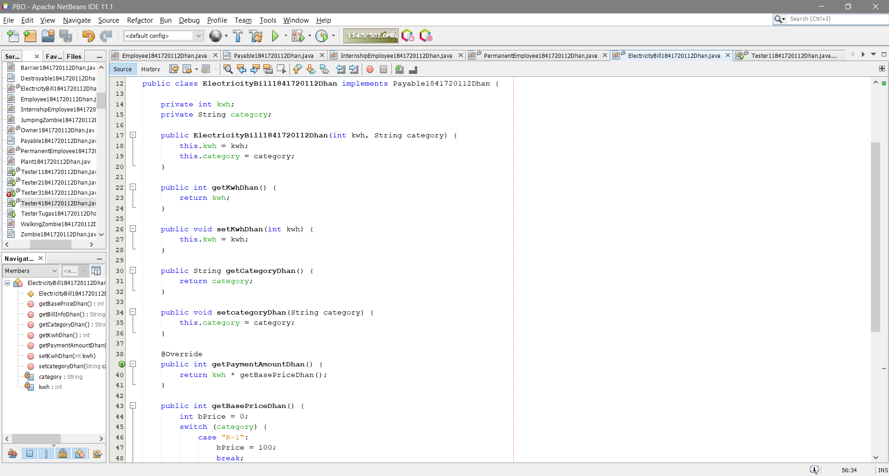

Link kode program : [ini link ke kode program](../../src/10_Polimorfisme/ElectricityBill1841720112Dhan.java)

6. Buat class Tester1
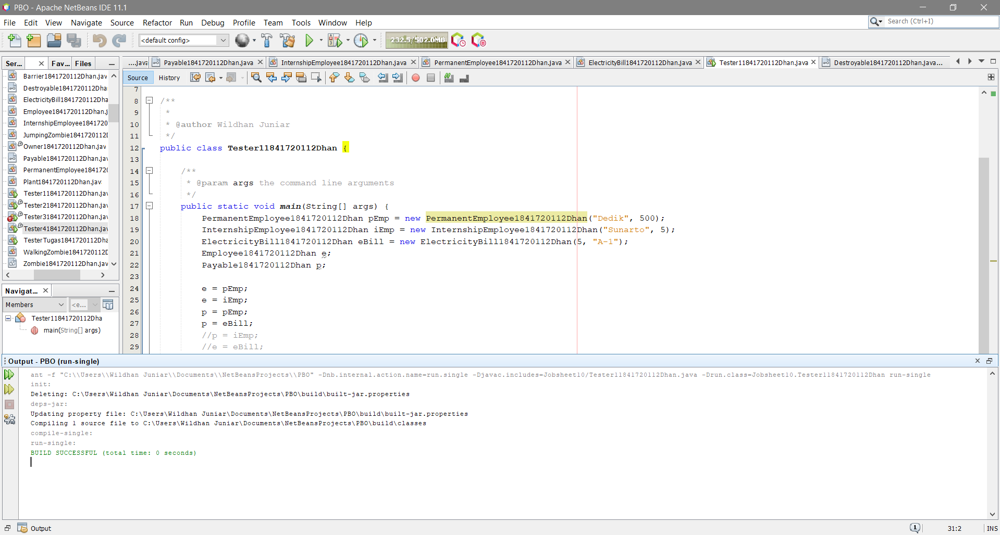

Link kode program : [ini link ke kode program](../../src/10_Polimorfisme/Tester11841720112Dhan.java)

## Pertanyaan

1. Class apa sajakah yang merupakan turunan dari class Employee?

    Jawab : InternshipEmployee dan PermanentEmployee

2. Class apa sajakah yang implements ke interface Payable?

    Jawab : PermanentEmployee dan ElectricityBill

3. Perhatikan class Tester1, baris ke-10 dan 11. Mengapa e, bisa diisi dengan objek pEmp (merupakan objek dari class PermanentEmployee) dan objek iEmp (merupakan objek dari class InternshipEmploye) ?

    Jawab: Karena turunan dari class Employee

4. Perhatikan class Tester1, baris ke-12 dan 13. Mengapa p, bisa diisi dengan objek pEmp (merupakan objek dari class PermanentEmployee) dan objek eBill (merupakan objek dari class ElectricityBill) ?

    Jawab : Karena objek pEmp dari class PermanentEmployee dan eBill dari class ElectricityBill mengimplementasi Payable

5. Coba tambahkan sintaks: p = iEmp; e = eBill; pada baris 14 dan 15 (baris terakhir dalam method main) ! Apa yang menyebabkan error?

    Jawab : Karena ElectricityBill tidak menjadi turunan dari class Employee dan InternshipEmployee tidak mengimplementasi Payable.

6. Ambil kesimpulan tentang konsep/bentuk dasar polimorfisme!

    Jawab : Konsep polimorfisme dapat diterapkan hanya pada class yang memiliki relasi inheritance. Polimorfisme juga dapat diterapkan pada interface, jadi ketika ada objek yang dideklarasikan dari suatu interface maka class tersebut bisa digunakan untuk mereferensi ke objek dari class yang mengimplements ke interface tersebut.

## Percobaan 2

Buat class baru dengan nama Tester2.
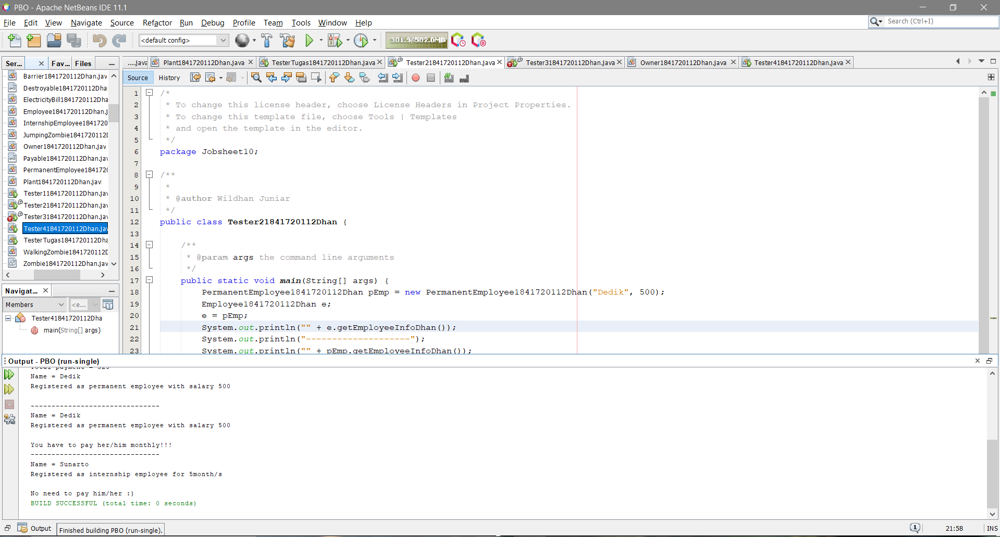

Link kode program : [ini link ke kode program](../../src/10_Polimorfisme/Tester21841720112Dhan.java)

## Pertanyaan 

1. Perhatikan class Tester2 di atas, mengapa pemanggilan e.getEmployeeInfo() pada baris 8 dan pEmp.getEmployeeInfo() pada baris 10 menghasilkan hasil sama?

    Jawab : Karena terdapat e = pEmp

2. Mengapa pemanggilan method e.getEmployeeInfo() disebut sebagai pemanggilan method virtual (virtual method invication), sedangkan pEmp.getEmployeeInfo() tidak?

    Jawab : Jika pemanggilan method getEmployeeInfo() dilakukan oleh objek pEmp (bukan objek polimorfisme), maka method tersebut yang dikenali saat dicompile dan dijalankan saat runtime adalah sama-sama method getEmployeeInfo() yang ada di class PermanentEmployee (karena objek pEmp dideklarasikan dari class PermanentEmployee).

3. Jadi apakah yang dimaksud dari virtual method invocation? Mengapa disebut virtual?

    Jawab : Virtual method invocation terjadi ketika ada pemanggilan overriding method dari suatu objek polimorfisme. Disebut virtual karena antara method yang dikenali oleh compiler dan method yang dijalankan oleh JVM berbeda.

## Percobaan 3

Buat class baru Tester3.
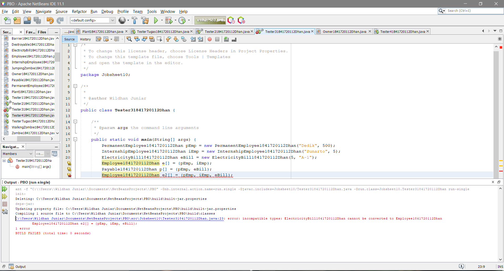

Link kode program : [ini link ke kode program](../../src/10_Polimorfisme/Tester31841720112Dhan.java)

## Pertanyaan

1. Perhatikan array e pada baris ke-8, mengapa ia bisa diisi denganobjek-objek dengan tipe yang berbeda, yaitu objek pEmp (objek dari PermanentEmployee) dan objek iEmp (objek dari InternshipEmployee) ?

    Jawab : Karena merupakan turunan dari class Employee

2. Perhatikan juga baris ke-9, mengapa array p juga biisi dengan objekobjek dengan tipe yang berbeda, yaitu objek pEmp (objek dari PermanentEmployee) dan objek eBill (objek dari ElectricityBilling) ?

    Jawab : Karena mengimplements Payable

3. Perhatikan baris ke-10, mengapa terjadi error?

    Jawab : Karena class ElectricityBill bukan turunan dari class Employee

## Percobaan 4

1. Buat class baru dengan nama Owner. Owner bisa melakukan pembayaran baik kepada pegawai permanen maupun rekening listrik melalui method pay(). Selain itu juga bisa menampilkan info pegawai permanen maupun pegawai magang melalui method showMyEmployee().
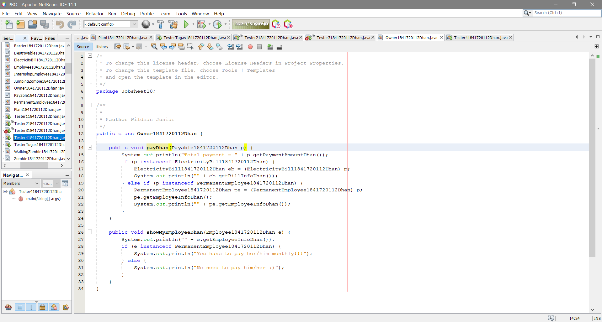

Link kode program : [ini link ke kode program](../../src/10_Polimorfisme/Owner1841720112Dhan.java)

2. Buat class baru Tester4.
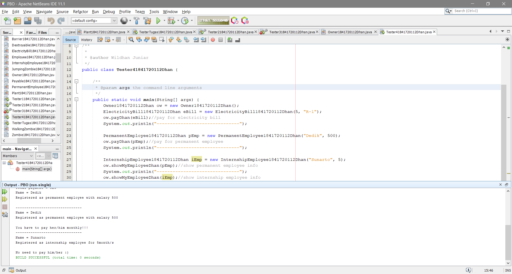

Link kode program : [ini link ke kode program](../../src/10_Polimorfisme/Tester41841720112Dhan.java)

## Pertanyaan

1. Perhatikan class Tester4 baris ke-7 dan baris ke-11, mengapa pemanggilan ow.pay(eBill) dan ow.pay(pEmp) bisa dilakukan, padahal jika diperhatikan method pay() yang ada di dalam class Owner memiliki argument/parameter bertipe Payable? Jika diperhatikan lebih detil eBill merupakan objek dari ElectricityBill dan pEmp merupakan objek dari PermanentEmployee?

    Jawab : Karena class ElectricityBill dan PermanentEmployee mengimplements Payable.

2. Jadi apakah tujuan membuat argument bertipe Payable pada method pay() yang ada di dalam class Owner?

    Jawab : Agar method tersebut bisa menerima nilai argument dari berbagai bentuk objek.

3. Coba pada baris terakhir method main() yang ada di dalam class Tester4 ditambahkan perintah ow.pay(iEmp); Mengapa terjadi error?

    Jawab : Karena class InternshipEmployee tidak megimplements Payable.

4. Perhatikan class Owner, diperlukan untuk apakah sintaks p instanceof ElectricityBill pada baris ke-6 ?

    Jawab : Untuk melakukan pengecekan apakah objek p merupakan hasil instansiasi dari class ElectricityBill.

5. Perhatikan kembali class Owner baris ke-7, untuk apakah casting objek disana (ElectricityBill eb = (ElectricityBill) p) diperlukan ? Mengapa objek p yang bertipe Payable harus di-casting ke dalam objek eb yang bertipe ElectricityBill ?

    Jawab : Untuk merubah tipe dari suatu objek. Karena tujuan casting harus dituliskan dalam tanda kurung, didepan objek yang akan dicasting.

## Tugas

Destroyable
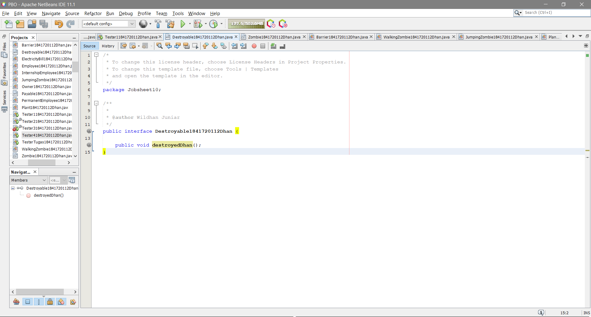

Link kode program : [ini link ke kode program](../../src/10_Polimorfisme/Destroyable1841720112Dhan.java)

Zombie
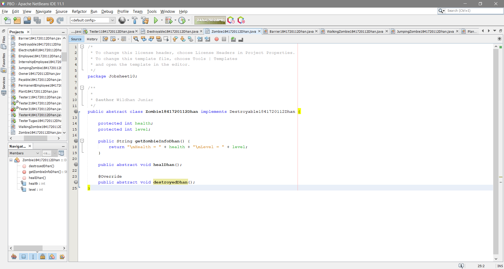

Link kode program : [ini link ke kode program](../../src/10_Polimorfisme/Zombie1841720112Dhan.java)

Barrier
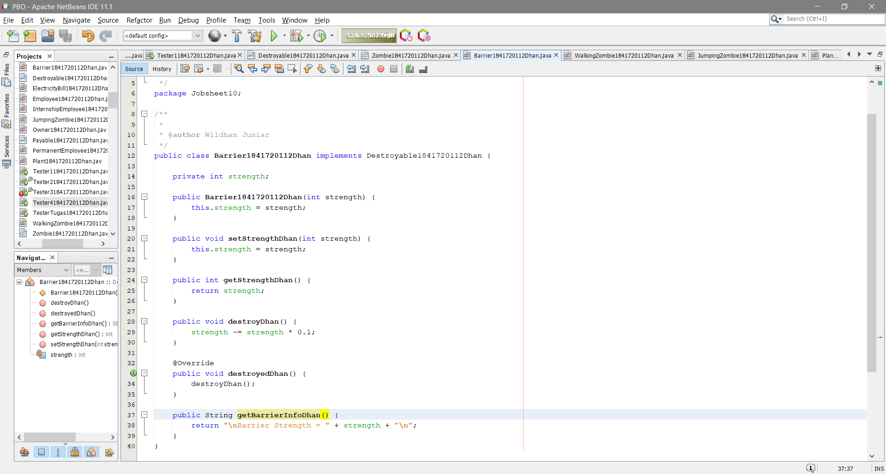

Link kode program : [ini link ke kode program](../../src/10_Polimorfisme/Barrier1841720112Dhan.java)

Walking Zombie
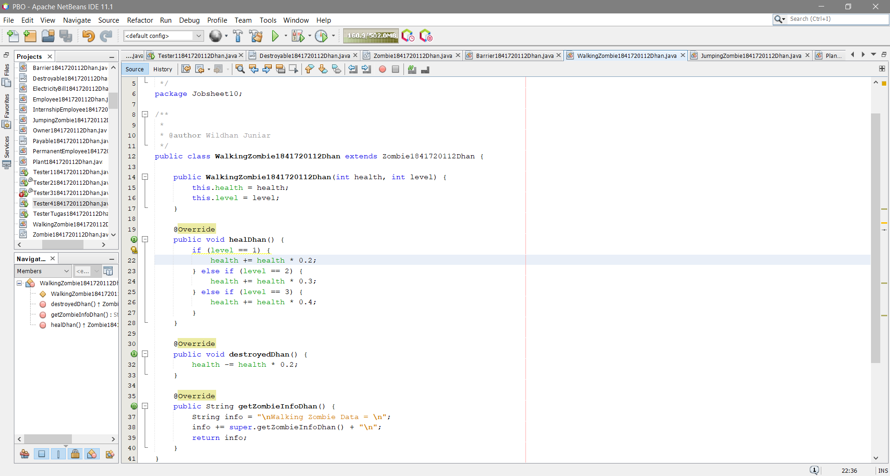

Link kode program : [ini link ke kode program](../../src/10_Polimorfisme/WalkingZombie1841720112Dhan.java)

Jumping Zombie
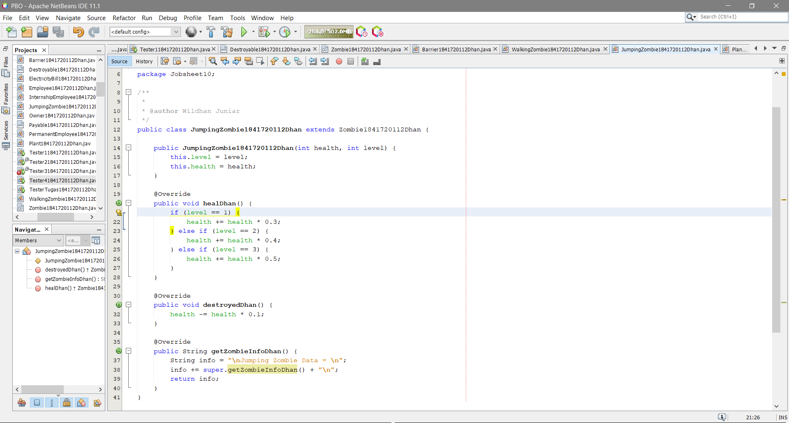

Link kode program : [ini link ke kode program](../../src/10_Polimorfisme/JumpingZombie1841720112Dhan.java)

Plant
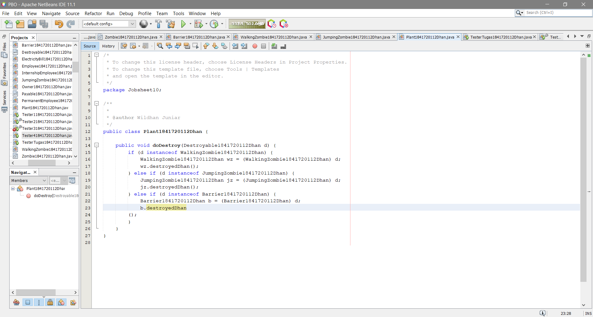

Link kode program : [ini link ke kode program](../../src/10_Polimorfisme/Plant1841720112Dhan.java)

Tester
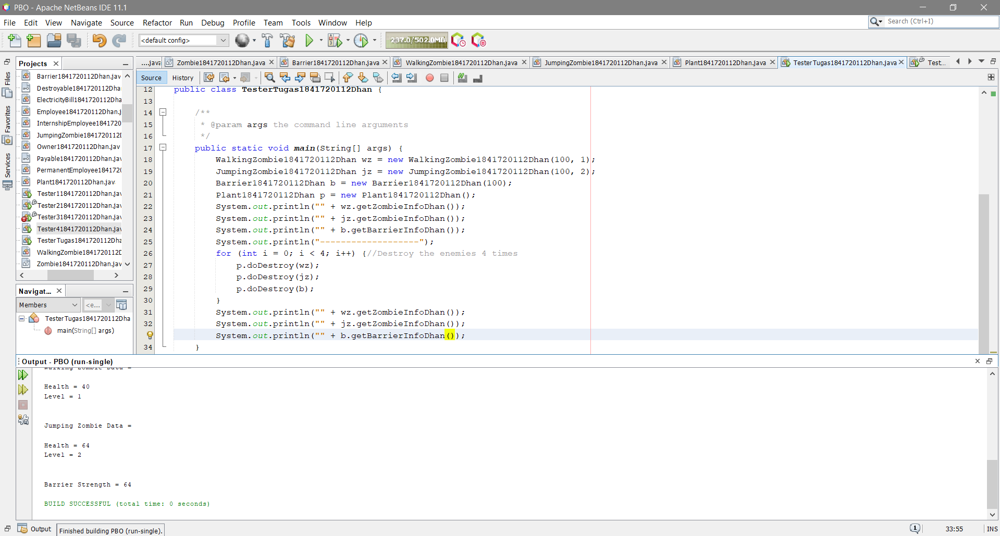

Link kode program : [ini link ke kode program](../../src/10_Polimorfisme/TesterTugas1841720112Dhan.java)

## Kesimpulan

Polimorfisme merupakan kemampuan suatu objek untuk memiliki banyak bentuk. Penggunaan polimorfisme yang paling umum dalam OOP terjadi ketika ada referensi super class yang digunakan untuk merujuk ke objek dari sub class. Dengan kata lain, ketika ada suatu objek yang dideklarasikan dari super class, maka objek tersebut bisa diinstansiasi sebagai objek dari sub class. Dari uraian tersebut bisa dilihat bahwa konsep polimorfisme bisa diterapkan pada class-class yang memiliki relasi inheritance (relasi generalisasi atau IS-A). Selain pada class-class yang memiliki relasi inheritance, polimorfisme juga bisa diterapkan pada interface. Ketika ada objek yang dideklarasikan dari suatu interface, maka ia bisa digunakan untuk mereferensi ke objek dari class-class yang implements ke interface tersebut.

## Pernyataan Diri

Saya menyatakan isi tugas, kode program, dan laporan praktikum ini dibuat oleh saya sendiri. Saya tidak melakukan plagiasi, kecurangan, menyalin/menggandakan milik orang lain.

Jika saya melakukan plagiasi, kecurangan, atau melanggar hak kekayaan intelektual, saya siap untuk mendapat sanksi atau hukuman sesuai peraturan perundang-undangan yang berlaku.

Ttd,

**Muhammad Wildhan Juniar Diharja Sardhany**