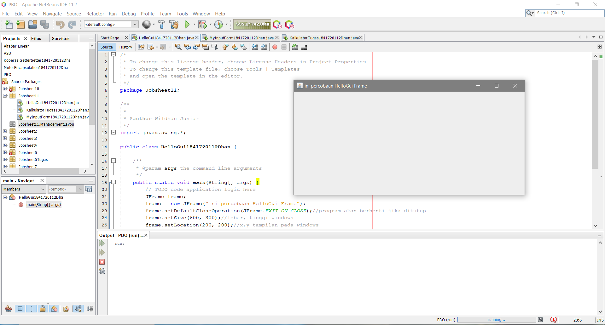
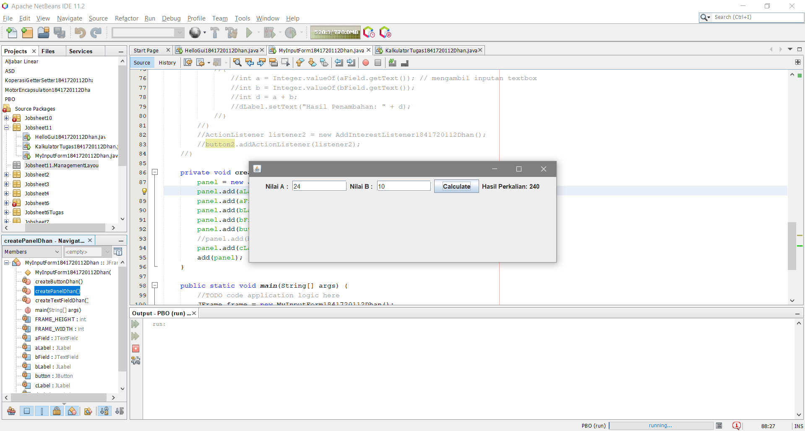
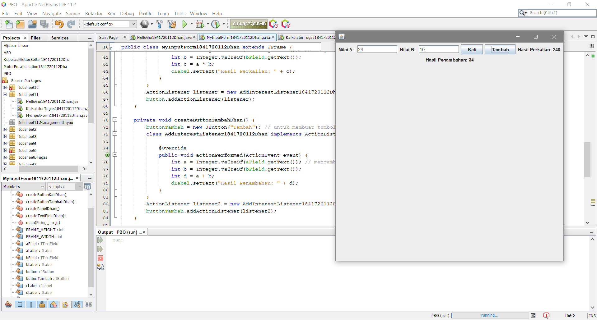
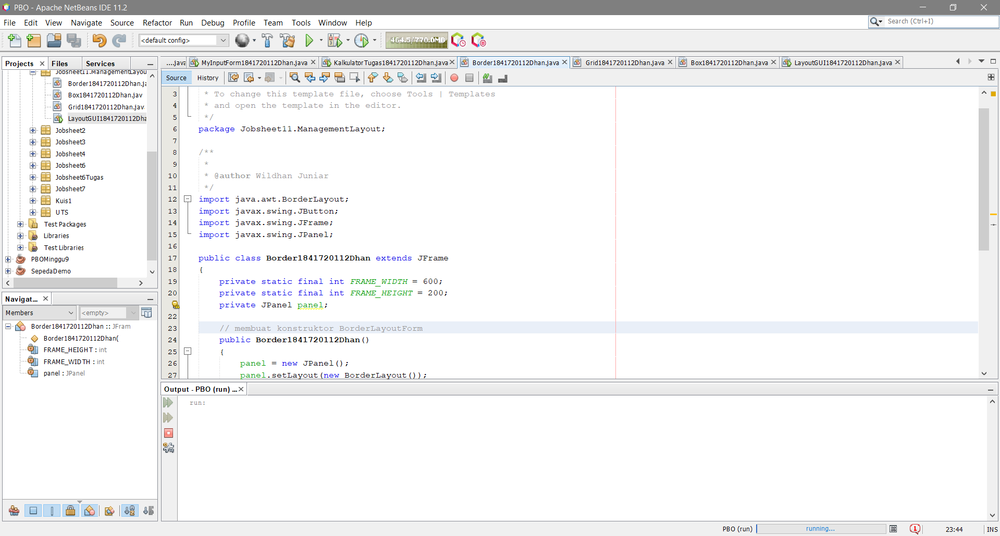
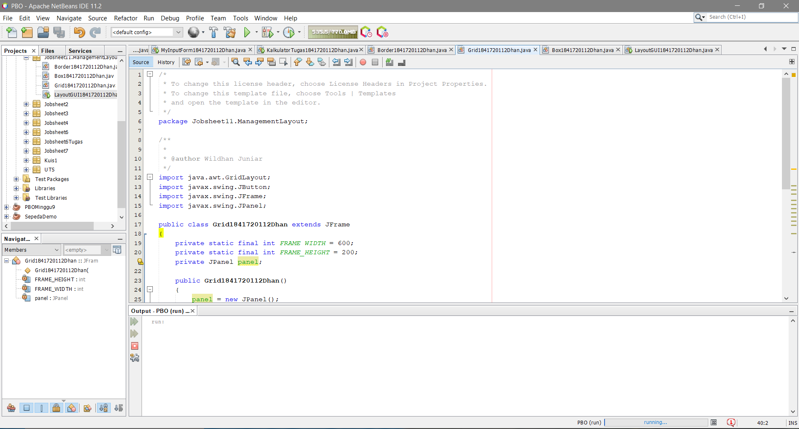
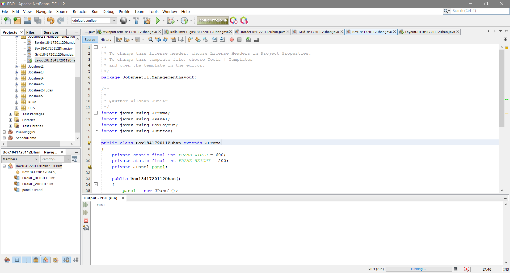
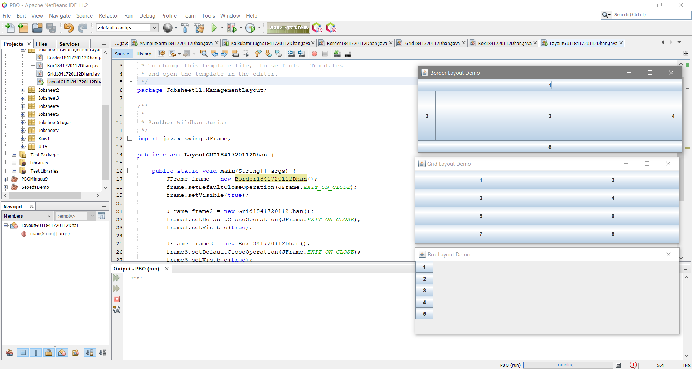
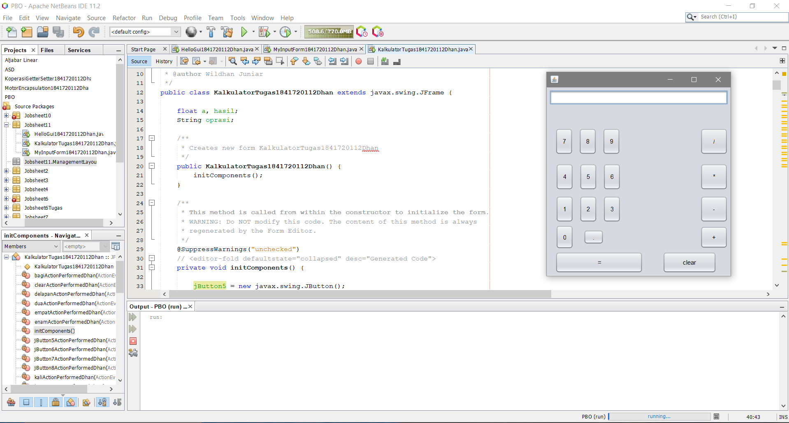

# Laporan Praktikum #11 - GUI

## Kompetensi

1. Membuat aplikasi Graphical User Interface sederhana dengan bahasa pemrograman java;
2. Mengenal komponen GUI seperti frame, label, textfield, combobox, radiobutton, checkbox, 
textarea, menu, serta table;
3. dan Menambahkan event handling pada aplikasi GUI.

## Ringkasan Materi

GUI digunakan untuk membuat tampilan grafis menjadi lebih menarik dan tidak membosankan. Dalam pemrograman GUI terdapat beberapa bagian yang harus dilakukan yaitu:

1. Membuat windows utama.
2. Menentukan komponen-komponen pendukung program.
3. Menentukan tata letak layout agar nantinya semua komponen – komponen yang sudah dipersiapkan bisa diaatur sedemikian rupa.
4. Event Handling dari sebuah aktivitas, seperti penekanan button, check box dan lain-lain.

## Percobaan 1

Class HelloGUI

Link kode program : [ini link ke kode program](../../src/11_GUI/HelloGui1841720112Dhan.java)

## Percobaan 2

Class MyInputForm

Link kode program : [ini link ke kode program](../../src/11_GUI/MyInputForm1841720112Dhan.java)
*kode sudah saya ubah berdasarkan ketentuan soal dibawah

## Pertanyaan 

Modifikasi kode program dengan menambahkan JButton baru untuk melakukan fungsi perhitungan penambahan, sehingga ketika button di klik (event click) maka akan menampilkan hasil penambahan dari nilai A dan B

    Jawab : 

Link kode program : [ini link ke kode program](../../src/11_GUI/MyInputForm1841720112Dhan.java)

## Percobaan 3

Class Border

Link kode program : [ini link ke kode program](../../src/11_GUI/Border1841720112Dhan.java)

Class Grid

Link kode program : [ini link ke kode program](../../src/11_GUI/Grid1841720112Dhan.java)

Class Box

Link kode program : [ini link ke kode program](../../src/11_GUI/Box1841720112Dhan.java)

Class LayoutGUI

Link kode program : [ini link ke kode program](../../src/11_GUI/LayoutGUI1841720112Dhan.java)

## Pertanyaan

1. Apa perbedaan dari Grid Layout, Box Layout dan Border Layout?

    Jawab : 
    
    •	Border yaitu komponen berdasarkan lokasi geografis, NORTH, SOUTH, EAST, WES T, and CENTER. 
    
    •	Grid yaitu menempatkan komponen dengan urutan dari kiri ke kanan dan dari atas ke bawah. GridLayout akan memaksa setiap komponen untuk menempati space container yang kosong serta membagi rata ukuran space tersebut
    
    •	Box yaitu menempatkan komponen dalam satu baris atau satu kolom

2. Apakah fungsi dari masing-masing kode berikut?

    Jawab : 
    
    •	JFrame frame = new Border(), JFrame frame2 = new Grid(),JFrame frame3 = new Box() 
    
    •	frame.setDefaultCloseOperation(JFrame.EXIT_ON_CLOSE) untuk  menentukan operasi ketika frame ditutup
    
    •	frame.setVisible(true) untuk  menampilkan frame, dimana parameter berisi tipe data yang bernilai true

## Percobaan 4

Class 

Link kode program : [ini link ke kode program](../../src/11_GUI/1841720112Dhan.java)

## Pertanyaan

1. Apakah fungsi dari kode berikut?

    Jawab : 

2. Mengapa pada bagian logika checkbox dan radio button digunakan multiple if ?

    Jawab : 

3.  Lakukan modifikasi pada program untuk melakukan menambahkan inputan berupa alamat dan berikan fungsi pemeriksaan pada nilai Alamat tersebut jika belum diisi dengan menampilkan pesan peringatan

    Jawab : 

## Percobaan 5

Class 

Link kode program : [ini link ke kode program](../../src/11_GUI/1841720112Dhan.java)

## Pertanyaan

1. Apa kegunaan komponen swing JTabPane, JTtree, pada percobaan 5?

    Jawab : 

2. Modifikasi program untuk menambahkan komponen JTable pada tab Halaman 1 dan tab Halaman 2

    Jawab : 

## Tugas

Kalkulator

Link kode program : [ini link ke kode program](../../src/11_GUI/KalkullatorTugas1841720112Dhan.java)

## Kesimpulan

Graphic User Interface (GUI) adalah pemrograman dengan bahasa Java yang dibuat menggunakan aplikasi yang berbasiskan GUI. Tujuannya adalah menambahkan beberapa komponen yang tidak bisa dibuat dalam basis text. Komponen – komponen tersebut bisa berupa tombol, gambar, dll. Tujuannya adalah untuk memudahkan user menggunakan program yang dibuat tersebut.0

## Pernyataan Diri

Saya menyatakan isi tugas, kode program, dan laporan praktikum ini dibuat oleh saya sendiri. Saya tidak melakukan plagiasi, kecurangan, menyalin/menggandakan milik orang lain.

Jika saya melakukan plagiasi, kecurangan, atau melanggar hak kekayaan intelektual, saya siap untuk mendapat sanksi atau hukuman sesuai peraturan perundang-undangan yang berlaku.

Ttd,

**Muhammad Wildhan Juniar Diharja Sardhany**