# Laporan Praktikum #12 - JAVA API

## Kompetensi

1. Memahami cara penyimpanan objek menggunakan Collection dan Map.
2. Mengetahui pengelompokan dari Collection.
3. Mengetahui perbedaan dari interface Set, List dan Map.
4. Mengetahui penggunaan class-class dari interface Set List, dan Map.
5. Memahami koneksi database menggunakan JDBC dan JDBC API


## Ringkasan Materi

Set mengikuti model himpunan, dimana objek/anggota yang tersimpan dalam Set harus unik. Urutan maupun letak dari anggota tidak penting, hanya keberadaan anggota saja yang penting. Kelas konkrit yang mengimplementasikan Set harus memastikan bahwa tidak terdapat elemen duplikat yang dapat ditambahkan ke dalam set. Yaitu, tidak terdapat dua elemen e1 dan e2 yang berada di dalam set yang membuat e1.equals(e2) bernilai true. ClassClass yang mengimplementasikan interface Set adalah HashSet. 

## Percobaan 1

Class CobaHashSet
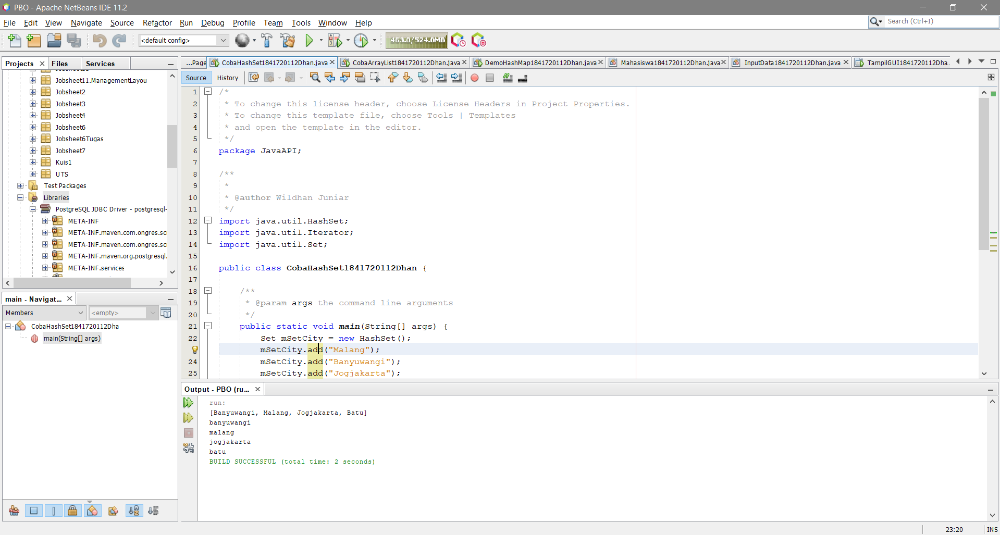

Link kode program : [ini link ke kode program](../../src/12_Java_API/CobaHashSet1841720112Dhan.java)

## Pertanyaan
1. Apakah fungsi import java.util.*; pada program diatas!

    Jawab: Berfungsi untuk mengimport semua class dalam java

2. Pada baris program keberapakah yang berfungsi untuk menciptakan object HashSet?

    Jawab : Pada baris ke 22, yaitu: 
    ```java
    Set mSetCity = new HashSet();
    ```

3. Apakah fungsi potongan program dibawah ini pada percobaan 1!
```java
mSetCity.add("Malang");
mSetCity.add("Banyuwangi");
mSetCity.add("Jogjakarta");
mSetCity.add("Batu");
```
    Jawab : Mengisi objek dalam index array

4. Tambahkan set.add(“Malang”); kemudian jalankan program! Amati hasilnya dan jelaskan mengapa terjadi error!

    Jawab : Karena dalam pengisian data , tidak menggunakan objek “mSetCity”
    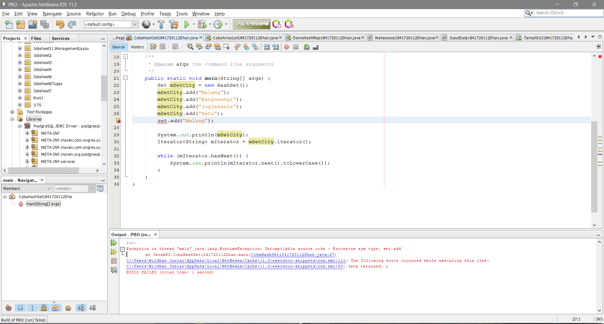

5. Jelaskan fungsi potongan program dibawah ini pada percobaan 1!

    Jawab:  Iterator digunakan untuk mengakses dan menampilkan nilai beserta tambahan method lain yang didefinisikan di dalam interface Iterator. Kode tersebut juga digunakan untuk menampilkan nilai dengan lower case

## Percobaan 2

Class CobaArrayList
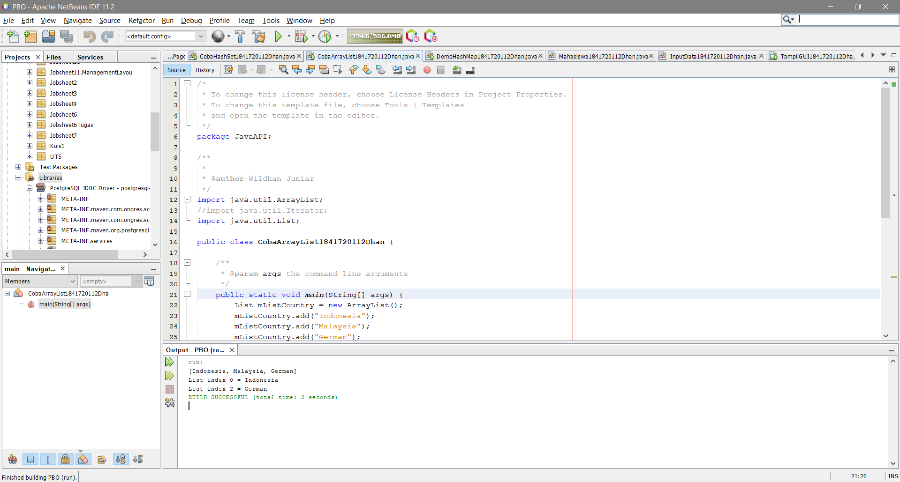

Link kode program : [ini link ke kode program](../../src/12_Java_API/CobaArrayList1841720112Dhan.java)

## Pertanyaan 

1. Apakah fungsi potongan program dibawah ini!

    Jawab :  Menampilkan data string yang sesuai dengan indeks array

2. Ganti potongan program pada soal no 1 menjadi sebagai berikut
Kemudian jalankan program tersebut!

    Jawab : 
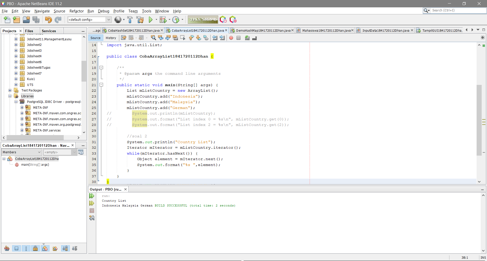

3. Jelaskan perbedaan menampilkan data pada ArrayList menggunakan potongan program pada soal no 1 dan no 2!

    Jawab :  pada soal no 1 pemanggilan data menggunakan inputan indeks array, sedangkan pada soal no 2 menggunakan iterasi, dimana jika ada data maka akan ditampilkan secara berurutan, jika tidak ada, maka proses iterasi berhenti 

## Percobaan 3

Class DemoHashMap
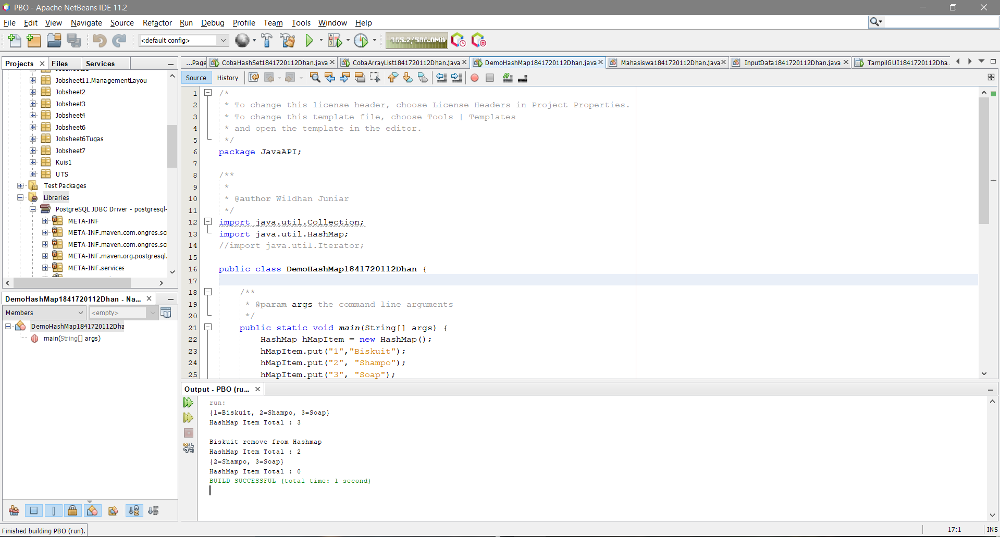

Link kode program : [ini link ke kode program](../../src/12_Java_API/DemoHashMap1841720112Dhan.java)

## Pertanyaan

1. Jelaskan fungsi hMapItem.put("1","Biskuit") pada program!

    Jawab : Menambahkan isi map dengan pasangan kunci dan nilai. Kedua kunci dan nilai yang berupa sebuah objek. Jika map tidak memiliki kunci maka nilai yang di pilih akan diganti dengan yang baru. Con’t “A[kunci] = nilai” dalam array 

2. Jelaskan fungsi hMapItem.size() pada program!

    Jawab : Untuk menghitung menghitung hMapItem

3. Jelaskan fungsi hMapItem.remove("1") pada program!

    Jawab : Untuk menghapus kunci beserta nilai yang ditunjuknya, atau dengan kata lain menghapus pasangan kunci dan nilai pada map sekaligus. Per-element

4. Jelaskan fungsi hMapItem.clear() pada program!

    Jawab : Menghapus semua pasangan asosiasi dalam map

5. Tambahkan kode program yang di blok pada program yang sudah anda buat!

    Jawab : 
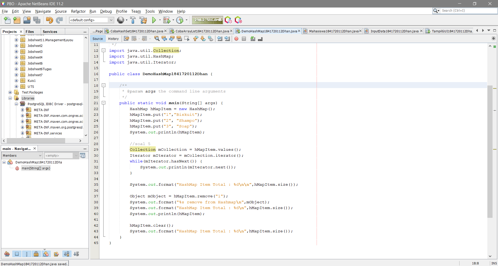

6. Jalankan program dan amati apa yang terjadi!

    Jawab : 
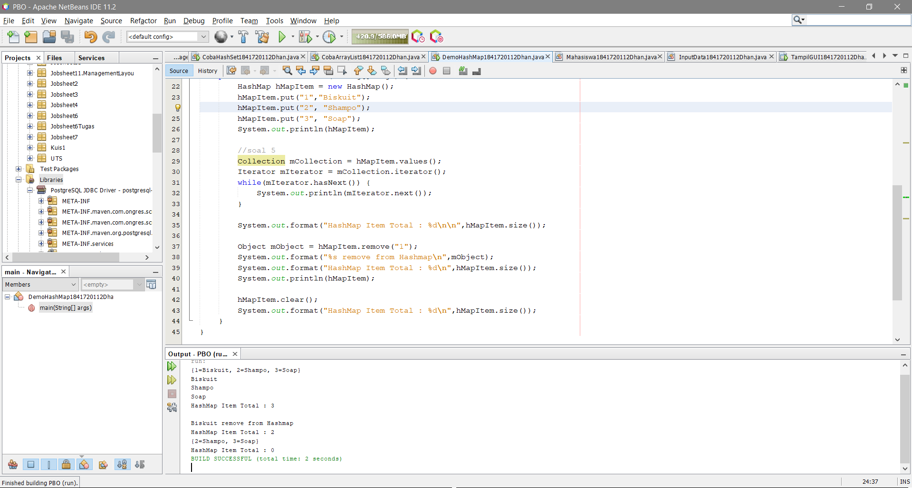

7. Apakah perbedaan program sebelumnya dan setelah ditambahkan kode program pada soal no 5 diatas? Jelaskan!

    Jawab : Kode program diatas mIterator digunakan untuk menampilkan element pada collection. Yang mana mCollection tersebut mengambil value dari hMapItem

## Percobaan 4

Class Mahasiswa
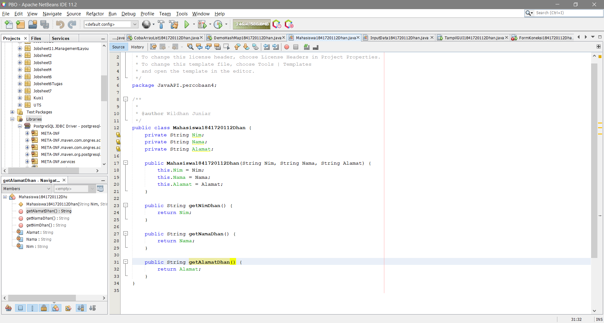

Link kode program : [ini link ke kode program](../../src/12_Java_API/Mahasiswa1841720112Dhan.java)

Class InputData
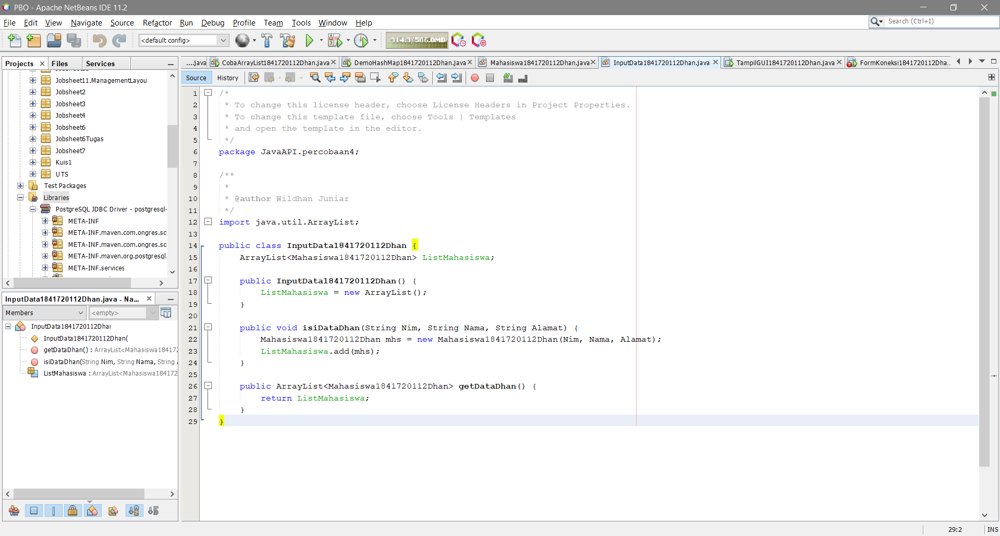

Link kode program : [ini link ke kode program](../../src/12_Java_API/InputData1841720112Dhan.java)

Class TampilGui
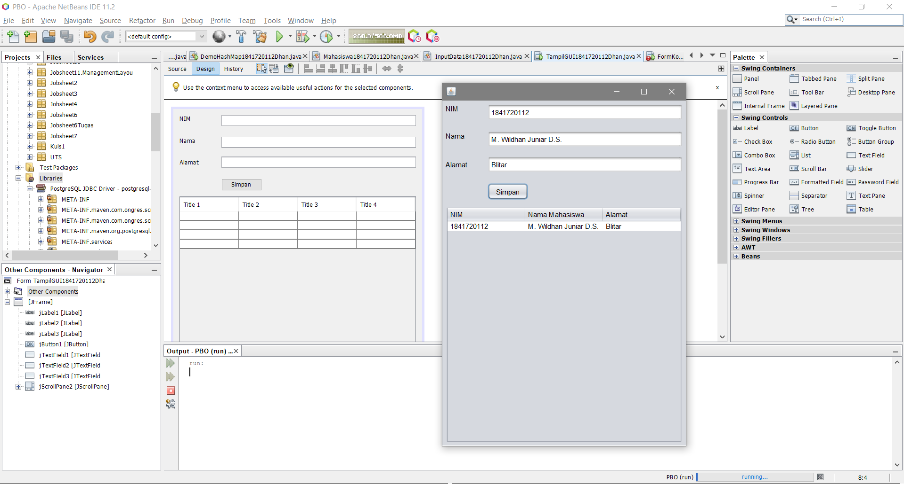

Link kode program : [ini link ke kode program](../../src/12_Java_API/TampilGui1841720112Dhan.java)

## Percobaan 5

#note: disini saya gagal melakukan percobaan karena masih bingung dalam mengimport libraries mysql
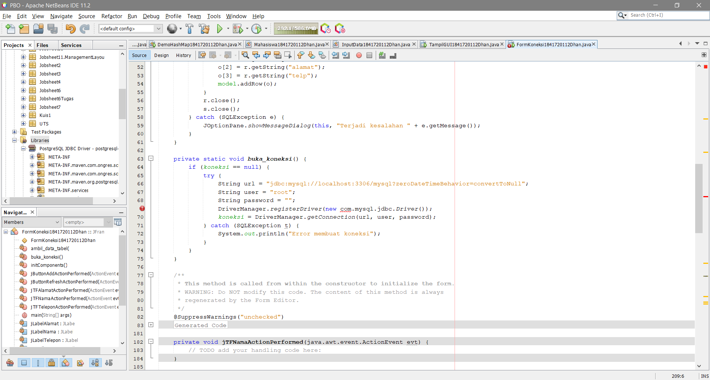

Link kode program : [ini link ke kode program](../../src/12_Java_API/FormKoneksi1841720112Dhan.java)

## Pertanyaan

pertanyaan tidak terjawab dikarenakan gagal melakukan percobaan

## Kesimpulan

Collection merupakan sebuah objek yang dapat digunakan untuk menyimpan sekumpulan objek. 
Objek yang ada dalam collection disebut elemen. Collection menyimpan elemen bertipe objek. 
Class – class collection tergabung kedalam Java Collection Framework.  
 
Set ialah metode himpunan yang mana sebuah objek/anggota tersimpan dalam Set harus unik 
• HashSet digunakan untuk menyimpan elemen-elemen bebas duplikat. 
Set <nama_objek_HashSet> = new HashSet(); 
 
List digunakan untuk menyimpan sekumpulan objek berdasarkan urutan masuk dan 
menerima duplikat 
• ArrayList digunakan untuk membuat Array yang dinamis 
ArrayList<nama_objek_arraylist>=new ArrayList(); 
 
Map untuk dapat menyimpan objek dalam map diperlukan sepasang objek yaitu key yang 
unik 
• HashMap class Implementasi dari Mao 
HashMap <nama_objek_HashMap> = new HashMap(); 
 
JDBC API 
Fungsi  
1. Membangun koneksi antara aplikasi java dan database 
2. Membangun dan mengeksekusi query 
3. Memproses hasil 


## Pernyataan Diri

Saya menyatakan isi tugas, kode program, dan laporan praktikum ini dibuat oleh saya sendiri. Saya tidak melakukan plagiasi, kecurangan, menyalin/menggandakan milik orang lain.

Jika saya melakukan plagiasi, kecurangan, atau melanggar hak kekayaan intelektual, saya siap untuk mendapat sanksi atau hukuman sesuai peraturan perundang-undangan yang berlaku.

Ttd,

**Muhammad Wildhan Juniar Diharja Sardhany**