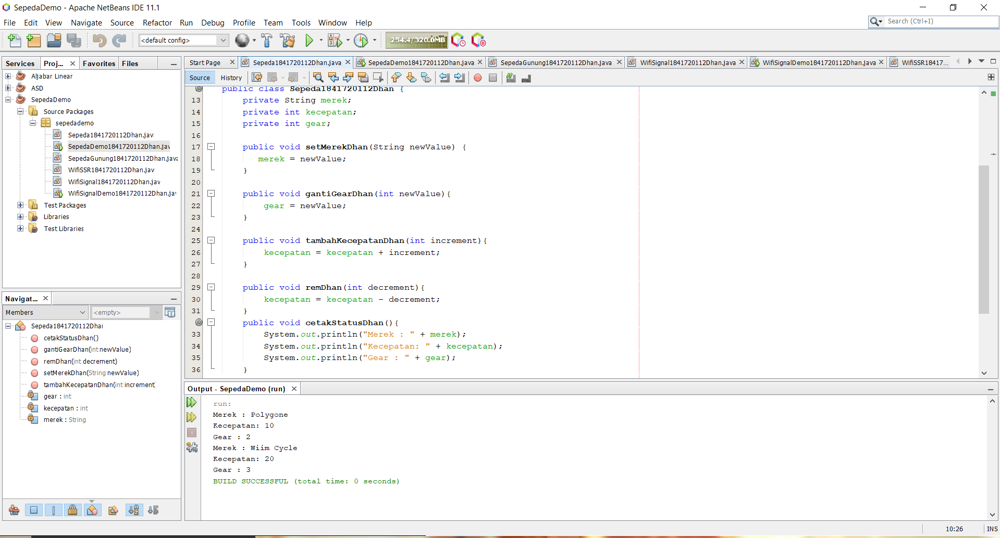
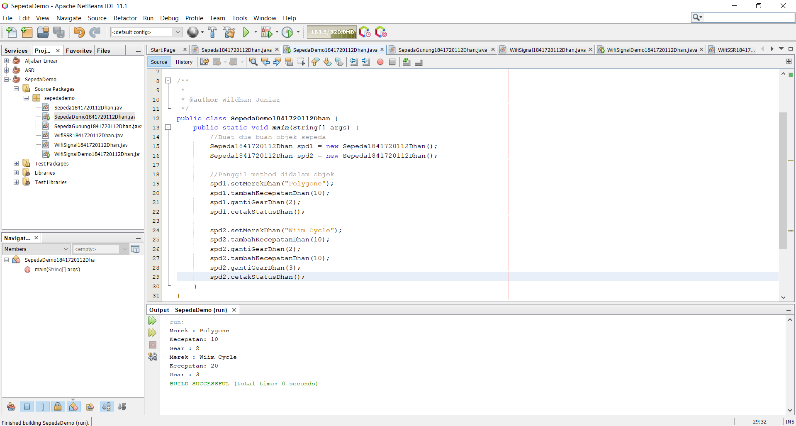
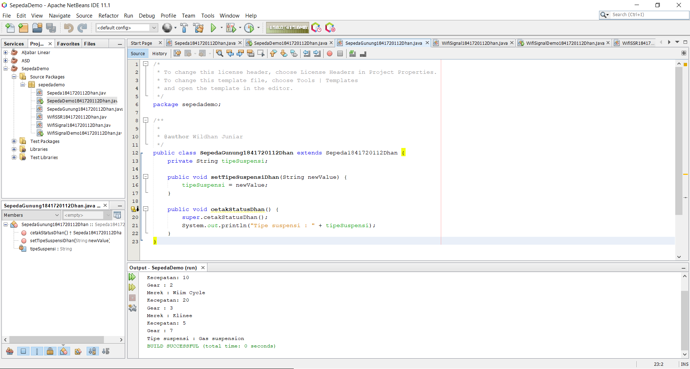
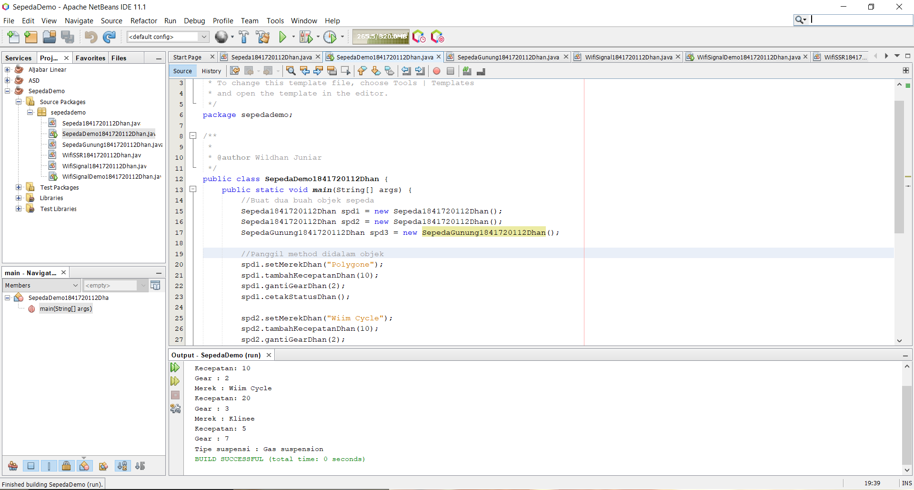
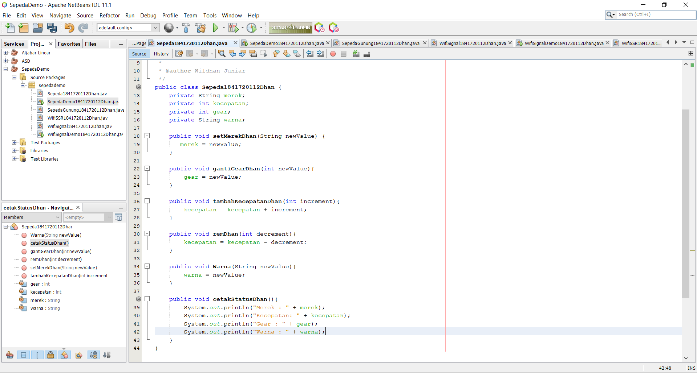
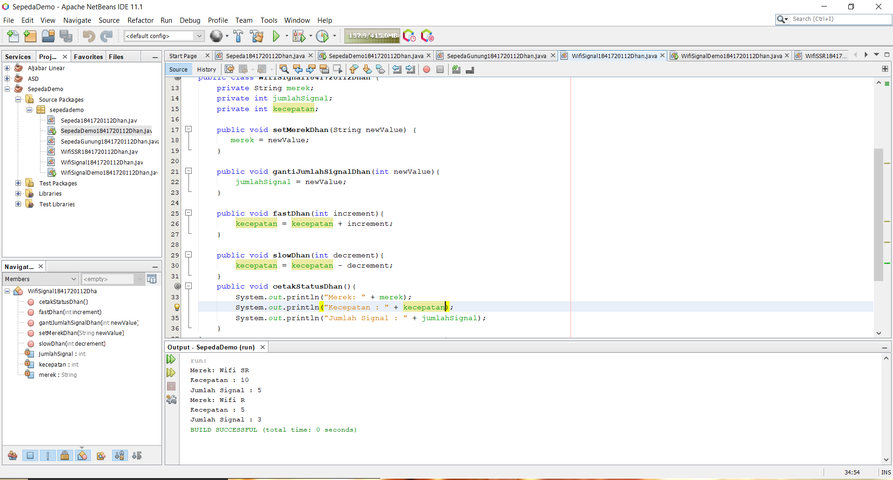
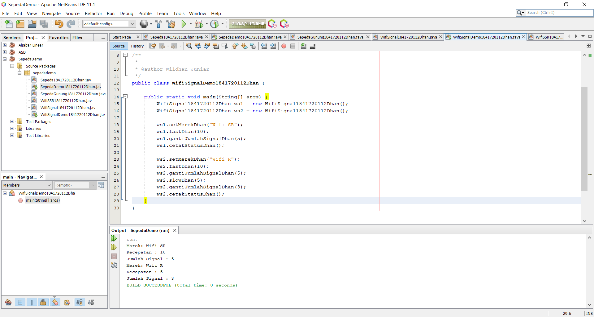
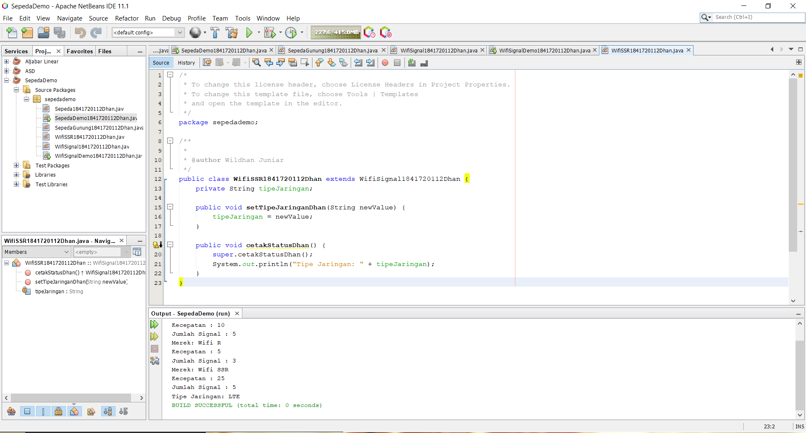
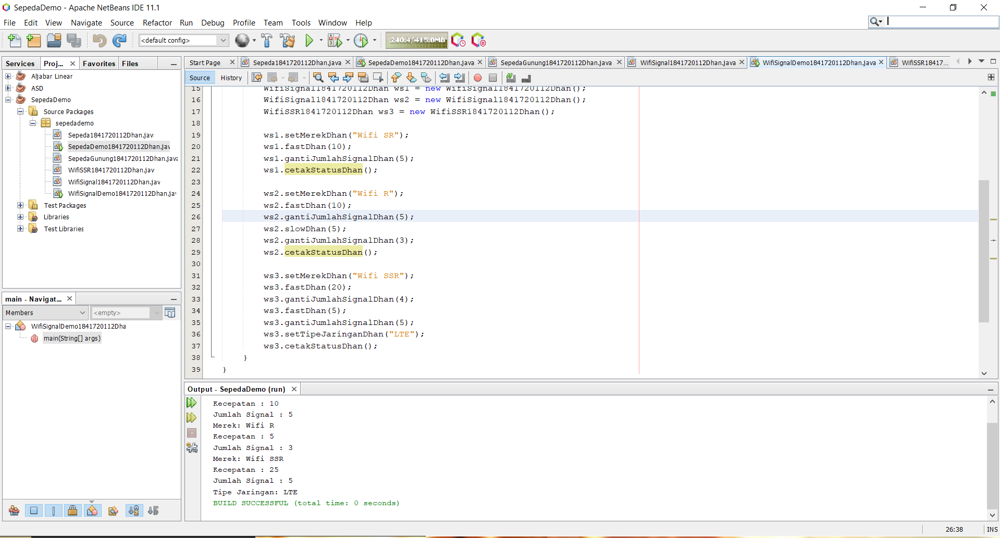

# Laporan Praktikum #1 - Pengantar Konsep PBO

## Kompetensi

1. Perbedaan paradigma berorientasi objek dengan paradigma struktural 
2. Konsep dasar PBO 

## Ringkasan Materi

Saya mencoba untuk menggabungkan increment dan decrement dalam 1 kasus di dalam tugas saya, awalnya saya sedikit bingung tentang apa yang akan terjadi.

## Percobaan

### Percobaan 1

program Sepeda

link kode program : [ini contoh link ke kode program](../../src/1_Pengantar_Konsep_PBO/Sepeda1841720112Dhan.java)

link kode program : [ini contoh link ke kode program](../../src/1_Pengantar_Konsep_PBO/SepedaDemo1841720112Dhan.java)

### Percobaan 2

link kode program : [ini contoh link ke kode program](../../src/1_Pengantar_Konsep_PBO/SepedaGunung1841720112Dhan.java)

link kode program : [ini contoh link ke kode program](../../src/1_Pengantar_Konsep_PBO/SepedaDemo1841720112Dhan.java)

## Pertanyaan

1.  1. INHERITANCE : Turunan yang memiliki super class dan sub class. 
    2. POLYMORPHISM : Berarti "banyak bentuk atau banyak cara", dan itu terjadi ketika kita memiliki banyak class yang terkait satu sama lain melalui pewarisan.
    3. ENCAPSULATION : Merupakan pengumpulan / pembungkusan state(atribut) dan behaviour menjadi satu object dalam bentuk class.
    4. ABSTRACTION :Suatu cara untuk melihat suatu object dalam bentuk yang lebih sederhana.
2.  Object adalah pemanfaatan dari class yang siap untuk digunakan, sedangkan Class merupakan kumpulan dari suatu fungsi-fungsi yang dibuat untuk suatu tujuan tertentu.
3.  Tidak ada pemisahan antara fase desain dan analisis, sehingga meningkatkan komunikasi antara user dan developer dari awal hingga akhir pembangunan sistem.
4.  Merek, kecepatan, gear.
5.  
6.  Karena sudah menggunakan fungsi extends ke class sepeda.

## Tugas

link kode program : [ini contoh link ke kode program](../../src/1_Pengantar_Konsep_PBO/WifiSignal1841720112Dhan.java)

Contoh link kode program : [ini contoh link ke kode program](../../src/1_Pengantar_Konsep_PBO/WifiSignalDemo1841720112Dhan.java)

Contoh link kode program : [ini contoh link ke kode program](../../src/1_Pengantar_Konsep_PBO/WifiSSR1841720112Dhan.java)

Contoh link kode program : [ini contoh link ke kode program](../../src/1_Pengantar_Konsep_PBO/WifiSignalDemo1841720112Dhan.java)
## Kesimpulan

Kesimpulan yang saya dapat adalah increment dan decrement yang digabungkan dalam 1 kasus saling mempengaruhi dengan urutan seperti yang sudah ditentukan di dalam syntax yang dibuat.

## Pernyataan Diri

Saya menyatakan isi tugas, kode program, dan laporan praktikum ini dibuat oleh saya sendiri. Saya tidak melakukan plagiasi, kecurangan, menyalin/menggandakan milik orang lain.

Jika saya melakukan plagiasi, kecurangan, atau melanggar hak kekayaan intelektual, saya siap untuk mendapat sanksi atau hukuman sesuai peraturan perundang-undangan yang berlaku.

Ttd,

Muhammad Wildhan Juniar Diharja Sardhany
