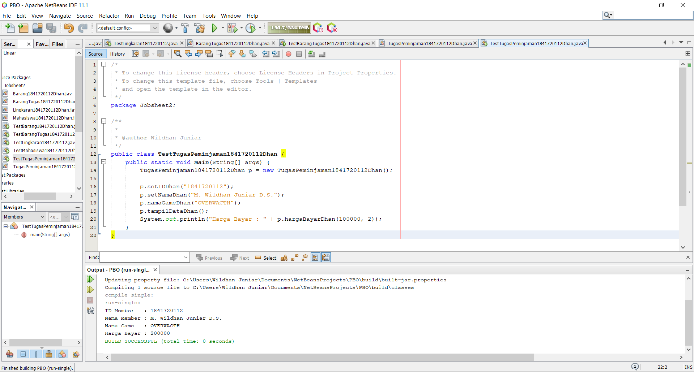
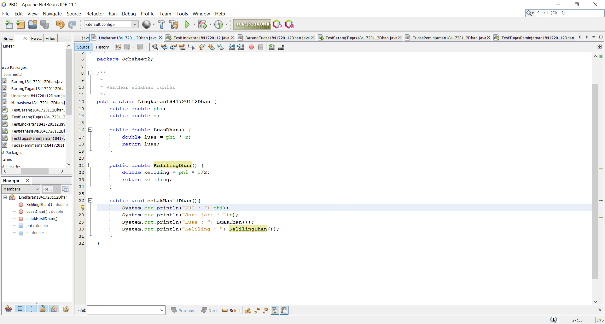
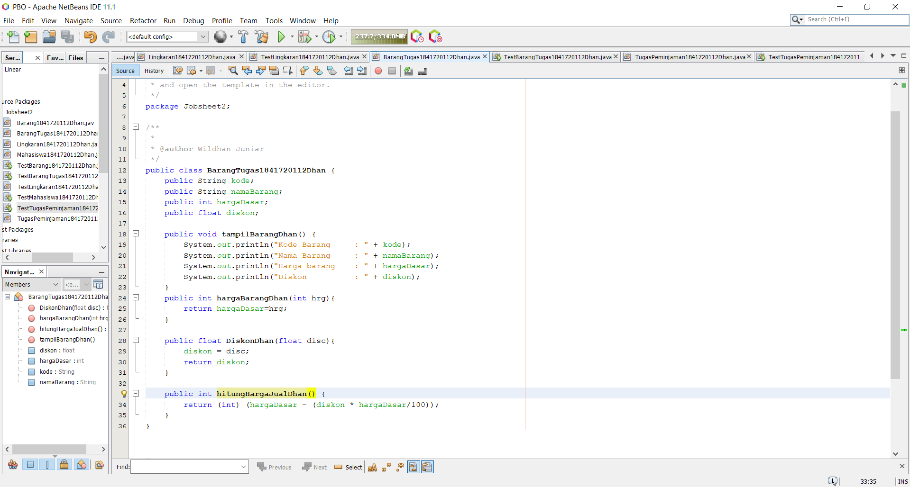

# Laporan Praktikum #2 - Class dan Object

## Kompetensi

1. Mahasiswa dapat memahami deskripsi dari class dan object
2. Mahasiswa memahami implementasi dari class
3. Mahasiswa dapat memahami implementasi dari attribute
4. Mahasiswa dapat memahami implementasi dari method
5. Mahasiswa dapat memahami implementasi dari proses instansiasi
6. Mahasiswa dapat memahami implementasi dari try-catch
7. Mahasiswa dapat memahami proses pemodelan class diagram menggunakan UML

## Ringkasan Materi

Mencoba untuk membuat class yang didalamnya mempunyai objek yang bervariasi

## Percobaan

### Percobaan 1

1. 
2. Class yang bisa dibuat dari studi kasus 1: Karyawan, KaryawanMain
3. Atribut beserta tipe datanya yang dapat diidentifikasi dari masing-masing
class dari studi kasus 1: int id; String nama; String jenis kelamin; String jabatan; float gaji;
4. Method-method yang sudah dibuat dari masing-masing class pada studi
kasus 1: void tampilDataDiri(); int tampilGaji();

### Percobaan 2

Link kode program : [ini link ke kode program](../../src/2_Class_dan_Object/Mahasiswa1841720112Dhan.java)

Link kode program : [ini link ke kode program](../../src/2_Class_dan_Object/TestMahasiswa1841720112Dhan.java)

### Percobaan 3

Link kode program : [ini link ke kode program](../../src/2_Class_dan_Object/Barang1841720112Dhan.java)

Link kode program : [ini link ke kode program](../../src/2_Class_dan_Object/TestBarang1841720112Dhan.java)

## Tugas 1

## Tugas 2

Link kode program : [ini link ke kode program](../../src/2_Class_dan_Object/TugasPeminjaman1841720112Dhan.java)

Link kode program : [ini link ke kode program](../../src/2_Class_dan_Object/TestTugasPeminjaman1841720112Dhan.java)

## Tugas 3

Link kode program : [ini link ke kode program](../../src/2_Class_dan_Object/Lingkaran1841720112Dhan.java)

Link kode program : [ini link ke kode program](../../src/2_Class_dan_Object/TestLingkaran1841720112Dhan.java)

## Tugas 4

Link kode program : [ini link ke kode program](../../src/2_Class_dan_Object/BarangTugas1841720112Dhan.java)

Link kode program : [ini link ke kode program](../../src/2_Class_dan_Object/TestBarangTugas1841720112Dhan.java)

## Kesimpulan

Class adalah sebuah nilai abstrak dari sebuah objek. Jika ingin membuat class dengan objek didalamnya, maka deklarasinya harus dilakukan dalam objek-objek. Tidak hanya Objek saja, adapun attribute dan method yang merupakan bagian-bagian dari objek.

## Pernyataan Diri

Saya menyatakan isi tugas, kode program, dan laporan praktikum ini dibuat oleh saya sendiri. Saya tidak melakukan plagiasi, kecurangan, menyalin/menggandakan milik orang lain.

Jika saya melakukan plagiasi, kecurangan, atau melanggar hak kekayaan intelektual, saya siap untuk mendapat sanksi atau hukuman sesuai peraturan perundang-undangan yang berlaku.

Ttd,

Muhammad Wildhan Juniar Diharja Sardhany