# Laporan Praktikum #3 - Enkapsulasi

## Kompetensi

Setelah melakukan percobaan pada modul ini, mahasiswa memahami konsep:
1. Konstruktor
2. Akses Modifier
3. Atribut/method pada class
4. Intansiasi atribut/method
5. Setter dan getter
6. Memahami notasi pada UML Class Diagram

## Ringkasan Materi

Mempelajari kosep dari enkapsulasi, kontruktor, access modifier serta getter dan setter yang kemudian diterapkan pada kode program. Juga mempelajari tentang notasi UML dan fungsinya.

## Percobaan

### Percobaan 1

Membuat class motor

Link kode program : [ini link ke kode program](../../src/3_Enkapsulasi/Motor1841720112Dhan.java)
*Kode program awalnya adalah seperti pada screenshot di atas. Kode program yang dicantumkan adalah kode yang sudah tambahkan dengan ketentuan praktikum 2 dan pertanyaan nomor 3.

Membuat class motorDemo untuk menjalankan program pada class motor

Link kode program : [ini link ke kode program](../../src/3_Enkapsulasi/MotorDemo1841720112Dhan.java)
*Kode program awalnya adalah seperti pada screenshot di atas. Kode program yang dicantumkan adalah kode yang sudah tambahkan dengan ketentuan praktikum 2 dan pertanyaan nomor 3.

### Percobaan 2

Link kode program : [ini link ke kode program](../../src/3_Enkapsulasi/Motor1841720112Dhan.java)
*Kode program awalnya adalah seperti pada screenshot di atas. Kode program yang dicantumkan adalah kode yang sudah tambahkan dengan pertanyaan nomor 3.

Link kode program : [ini link ke kode program](../../src/3_Enkapsulasi/MotorDemo1841720112Dhan.java)
*Kode program awalnya adalah seperti pada screenshot di atas. Kode program yang dicantumkan adalah kode yang sudah tambahkan dengan pertanyaan nomor 3.

## Pertanyaan

1. Pada class MotorDemo1841720112Dhan, saat kita menambah kecepatan untuk pertama kalinya, mengapa muncul peringatan “Kecepatan tidak bisa bertambah karena Mesin Off!”?

    Jawab: Karena kita belum menjalankan syntax nyalakan mesin.
2. Mengapat atribut kecepatan dan kontakOn diset private?

    Jawab: Untuk menyembunyikan atribut tersebut agar tidak dapat diakses oleh class lain / MotorDemo1841720112Dhan
3. Ubah class Motor1841720112Dhan sehingga kecepatan maksimalnya adalah 100!

    Jawab: Di sini saya menambahkan ketentuan pada method tambahKecepatanDhan() menjadi seperti screenshot di bawah ini
    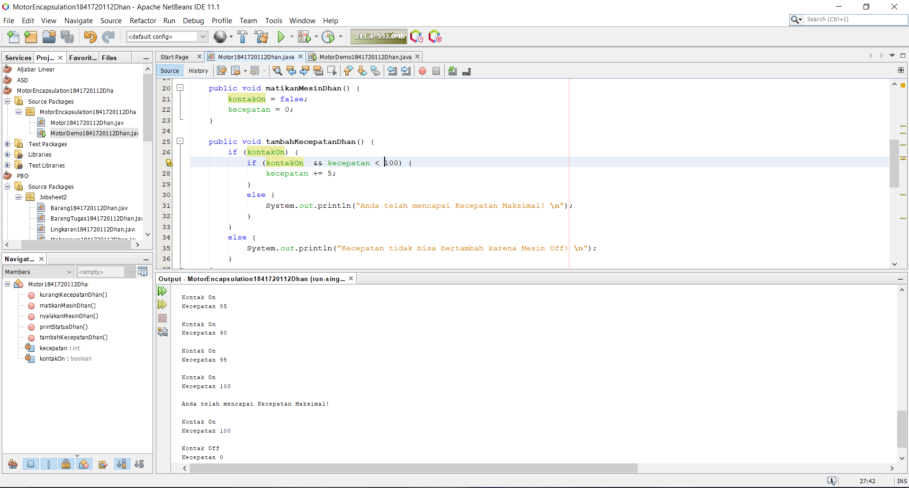
    serta menambahkan motor.tambahKecepatanDhan(); dan motor.printStatusDhan(); secukupnya sampai keluar kecepatan maksimal yaitu 100.

    Link kode program Motor1841720112Dhan yang sudah diubah kecepatan maksimalnya: [ini link ke kode program](../../src/3_Enkapsulasi/Motor1841720112Dhan.java)

### Percobaan 3

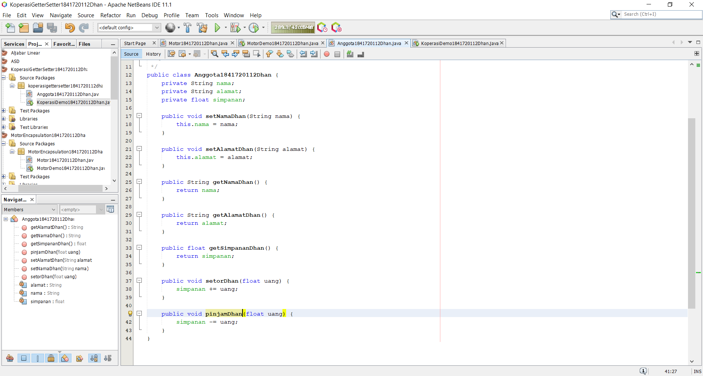

Link kode program : [ini link ke kode program](../../src/3_Enkapsulasi/Anggota1841720112Dhan.java)
*Kode program awalnya adalah seperti pada screenshot di atas. Kode program yang dicantumkan adalah kode yang sudah tambahkan dengan ketentuan praktikum 4.

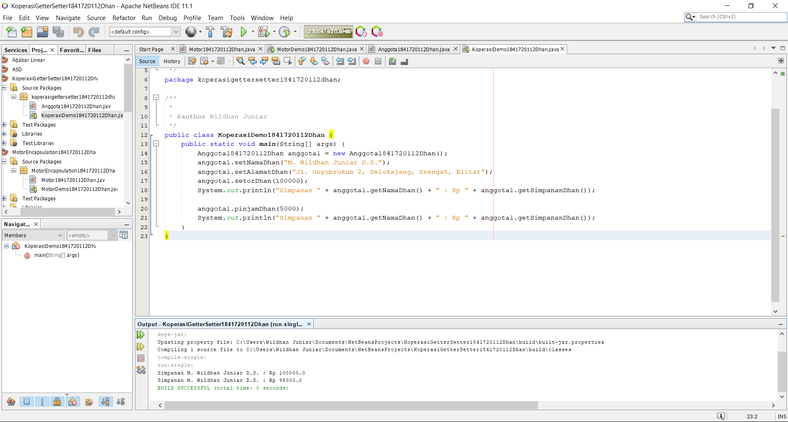

Link kode program : [ini link ke kode program](../../src/3_Enkapsulasi/KoperasiDemo1841720112Dhan.java)
*Kode program awalnya adalah seperti pada screenshot di atas. Kode program yang dicantumkan adalah kode yang sudah tambahkan dengan ketentuan praktikum 4.

### Percobaan 4

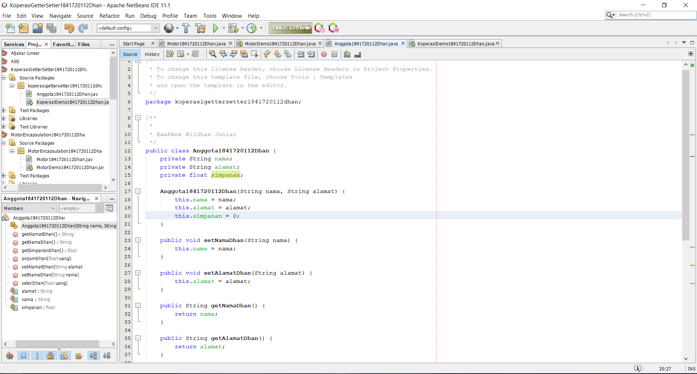

Link kode program : [ini link ke kode program](../../src/3_Enkapsulasi/Anggota1841720112Dhan.java)

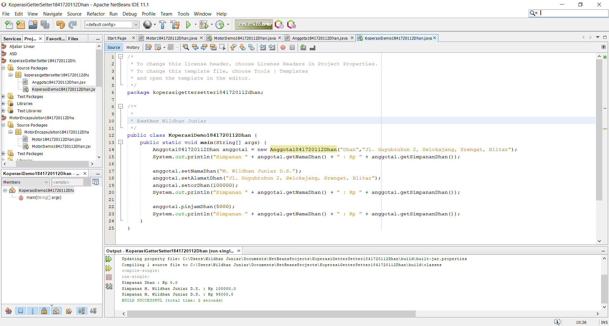

Link kode program : [ini link ke kode program](../../src/3_Enkapsulasi/KoperasiDemo1841720112Dhan.java)

## Pertanyaan

1. Apa yang dimaksud getter dan setter?

    Jawab: adalah dua method yang tugasnya untuk mengambil dan mengisi data ke dalam objek.
2. Apa kegunaan dari method getSimpanan()?

    Jawab: untuk mengambil data dari method Simpanan
3. Method apa yang digunakan untk menambah saldo?

    Jawab: setTambahSaldo()
4. Apa yang dimaksud konstruktor?
    
    Jawab: method yang pertama kali dijalankan pada saat sebuah objek pertama kali diciptakan.
5. Sebutkan aturan dalam membuat konstruktor?
    
    Jawab: harus memiliki nama yang sama dengan nama class-nya dan tidak memiliki nilai kembalian.

6. Apakah boleh konstruktor bertipe private?
    
    Jawab: tidak boleh, karena tipe private hanya dapad di akses pada 1 class saja.
7. Kapan menggunakan parameter dengan passing parameter?
    
    Jawab: ketika perubahan nilai hanya terjadi di dalam fungsi swap. Dimana bila mencetak data a dan b, nilai memang benar sudah terganti.
8. Apa perbedaan atribut class dan instansiasi atribut?

    Jawab: Atribut class adalah atribut yang dimiliki oleh semua obyek yang berasal dari class yang sama, sedangkan instansiasi atribut adalah atribut yang dimiliki oleh obyek dari class yang sama.
9. Apa perbedaan class method dan instansiasi method?

    Jawab: class method adalah method yang dimiliki oleh semua atribut yang berasal dari objek yang sama, sedangkan instansiasi method adalah method yang dimiliki oleh atribut dari objek yang sama.

## Tugas

### Tugas 1

Link kode program : [ini link ke kode program](../../src/3_Enkapsulasi/EncapDemo1841720112Dhan.java)
*kode program sudah di ubah sesuai dengan ketentuan tugas nomor 3, tugas nomor 1 sesuai screenshot di atas.

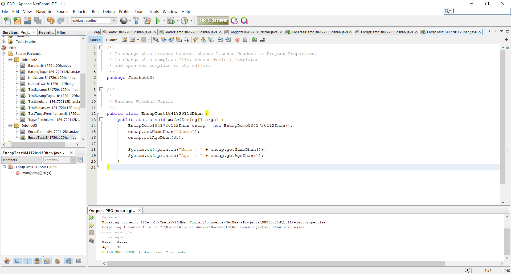

Link kode program : [ini link ke kode program](../../src/3_Enkapsulasi/EncapTest1841720112Dhan.java)
*kode program sudah di ubah sesuai dengan ketentuan tugas nomor 3, tugas nomor 1 sesuai screenshot di atas.

### Tugas 2

Karena di kelas EncapDemo dalam method setAge “if(newAge > 30)” menandakan bawahwa tidak bisa melebihi angka 30, Nilai 30 adalah angka maksimal. 
Melainkan jika memasukkan nilai kurang dari 30 maka hasilnya akan ditampilkan

### Tugas 3

Link kode program : [ini link ke kode program](../../src/3_Enkapsulasi/EncapDemo1841720112Dhan.java)

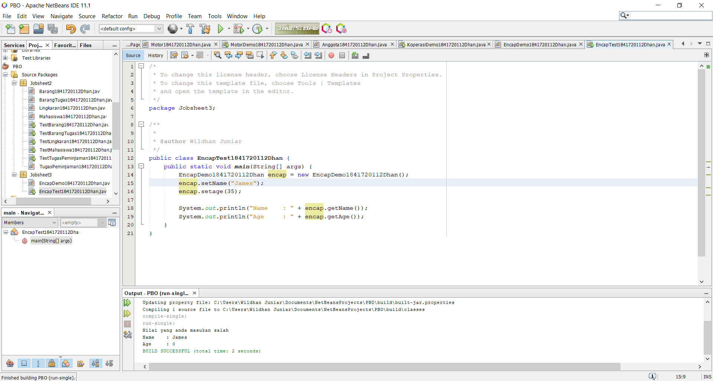

Link kode program : [ini link ke kode program](../../src/3_Enkapsulasi/EncapTest1841720112Dhan.java)

### Tugas 4

Link kode program : [ini link ke kode program](../../src/3_Enkapsulasi/AnggotaTugas1841720112Dhan.java)
*kode program telah di ubah mengikuti aturan tugas nomor 6, kode asli seperti screenshot di atas.

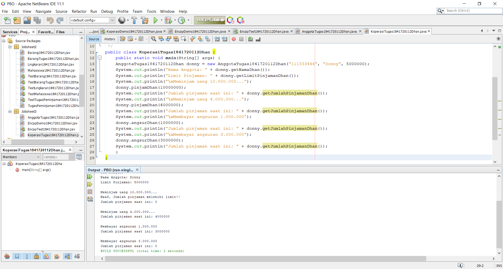

Link kode program : [ini link ke kode program](../../src/3_Enkapsulasi/KoperasiTugas1841720112Dhan.java)
*kode program telah di ubah mengikuti aturan tugas nomor 6, kode asli seperti screenshot di atas.

### Tugas 5

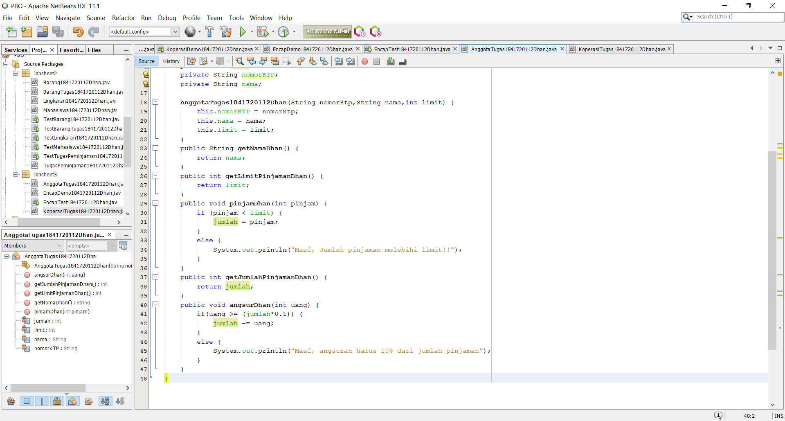

Link kode program : [ini link ke kode program](../../src/3_Enkapsulasi/AnggotaTugas1841720112Dhan.java)
*kode program telah di ubah mengikuti aturan tugas nomor 6, kode asli seperti screenshot di atas.

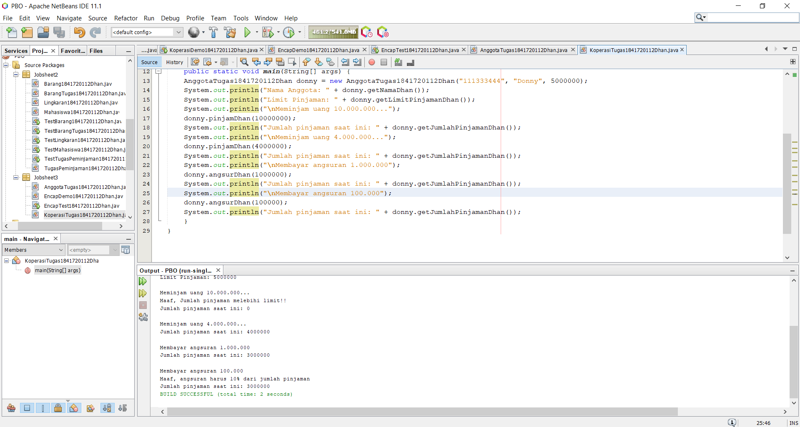

Link kode program : [ini link ke kode program](../../src/3_Enkapsulasi/KoperasiTugas1841720112Dhan.java)
*kode program telah di ubah mengikuti aturan tugas nomor 6, kode asli seperti screenshot di atas.

### Tugas 6

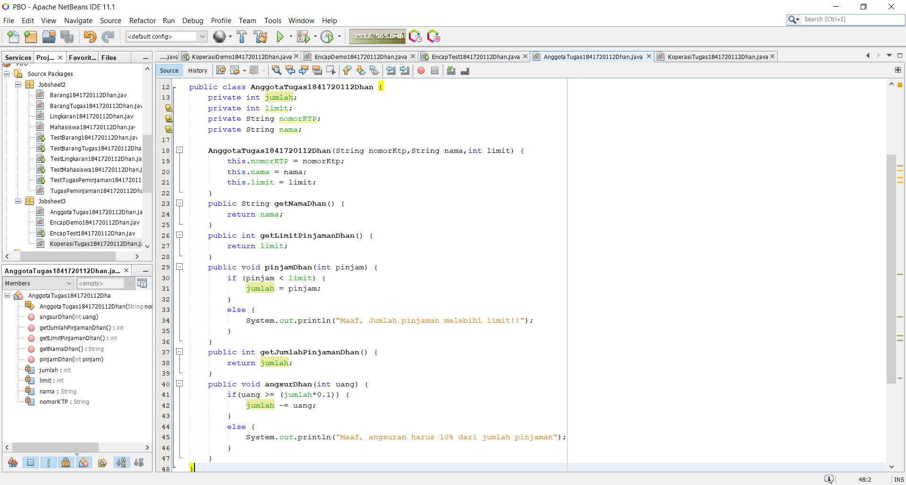

Link kode program : [ini link ke kode program](../../src/3_Enkapsulasi/AnggotaTugas1841720112Dhan.java)

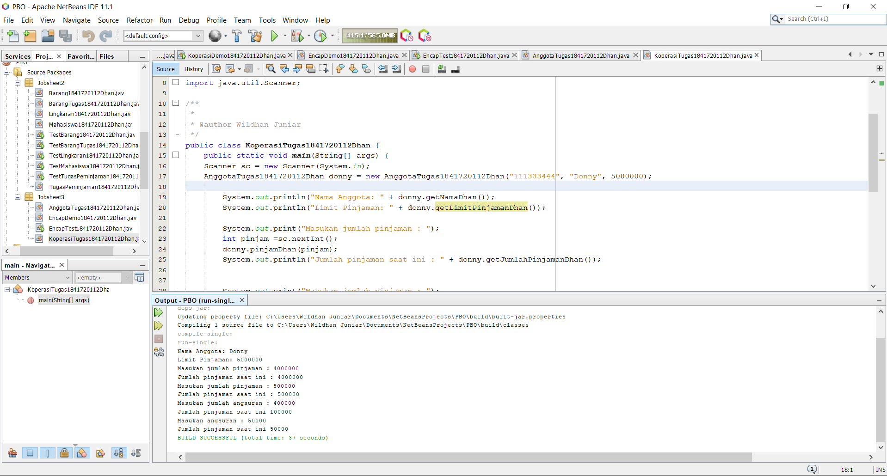

Link kode program : [ini link ke kode program](../../src/3_Enkapsulasi/KoperasiTugas1841720112Dhan.java)

## Kesimpulan

Kosep dari enkapsulasi, kontruktor, access modifier terdiri dari 4 jenis yaitu public, protected, default dan private. Konsep atribut atau method class ada di dalam blok kode class dan konsep instansiasi atribut atau method. Cara penggunaan getter dan setter beserta fungsi dari getter dan setter pada suatu kode program memiliki ketentuan tertentu. Notasi UML yang lebih rinci juga telah ditentukan dengan lambang seperti: -, +, #, dan kosong.

## Pernyataan Diri

Saya menyatakan isi tugas, kode program, dan laporan praktikum ini dibuat oleh saya sendiri. Saya tidak melakukan plagiasi, kecurangan, menyalin/menggandakan milik orang lain.

Jika saya melakukan plagiasi, kecurangan, atau melanggar hak kekayaan intelektual, saya siap untuk mendapat sanksi atau hukuman sesuai peraturan perundang-undangan yang berlaku.

Ttd,

Muhammad Wildhan Juniar Diharja Sardhany