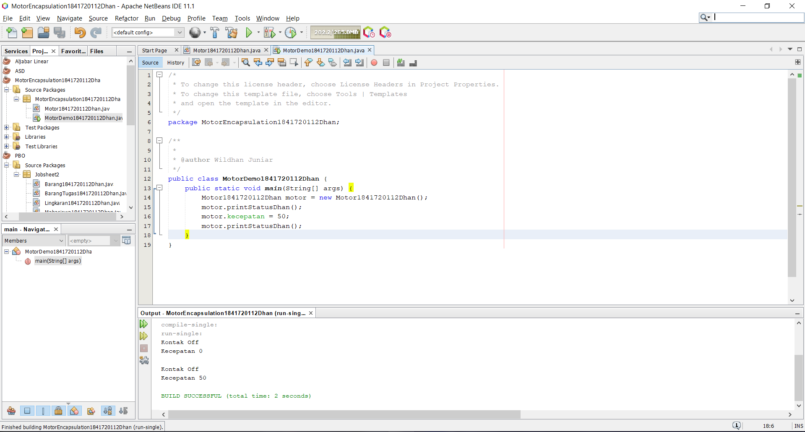

# Laporan Praktikum #3 - Enkapsulasi

## Kompetensi

Setelah melakukan percobaan pada modul ini, mahasiswa memahami konsep:
1. Konstruktor
2. Akses Modifier
3. Atribut/method pada class
4. Intansiasi atribut/method
5. Setter dan getter
6. Memahami notasi pada UML Class Diagram

## Ringkasan Materi

(isi)

## Percobaan

### Percobaan 1

Membuat class motor

Link kode program : [ini link ke kode program](../../src/3_Enkapsulasi/Mahasiswa1841720112Dhan.java)

*

Membuat class motorDemo untuk menjalankan program pada class motor

Link kode program : [ini link ke kode program](../../src/3_Enkapsulasi/Mahasiswa1841720112Dhan.java)

### Percobaan 2

Link kode program : [ini link ke kode program](../../src/3_Enkapsulasi/Mahasiswa1841720112Dhan.java)

Link kode program : [ini link ke kode program](../../src/3_Enkapsulasi/Mahasiswa1841720112Dhan.java)

### Percobaan 3

Link kode program : [ini link ke kode program](../../src/3_Enkapsulasi/Mahasiswa1841720112Dhan.java)

Link kode program : [ini link ke kode program](../../src/3_Enkapsulasi/Mahasiswa1841720112Dhan.java)

### Percobaan 4

Link kode program : [ini link ke kode program](../../src/3_Enkapsulasi/Mahasiswa1841720112Dhan.java)

Link kode program : [ini link ke kode program](../../src/3_Enkapsulasi/Mahasiswa1841720112Dhan.java)

## Tugas 1

## Tugas 2

Link kode program : [ini link ke kode program](../../src/2_Class_dan_Object/TugasPeminjaman1841720112Dhan.java)

Link kode program : [ini link ke kode program](../../src/2_Class_dan_Object/TestTugasPeminjaman1841720112Dhan.java)

## Tugas 3

Link kode program : [ini link ke kode program](../../src/2_Class_dan_Object/Lingkaran1841720112Dhan.java)

Link kode program : [ini link ke kode program](../../src/2_Class_dan_Object/TestLingkaran1841720112Dhan.java)

## Tugas 4

Link kode program : [ini link ke kode program](../../src/2_Class_dan_Object/BarangTugas1841720112Dhan.java)

Link kode program : [ini link ke kode program](../../src/2_Class_dan_Object/TestBarangTugas1841720112Dhan.java)

## Kesimpulan

Class adalah sebuah nilai abstrak dari sebuah objek. Jika ingin membuat class dengan objek didalamnya, maka deklarasinya harus dilakukan dalam objek-objek. Tidak hanya Objek saja, adapun attribute dan method yang merupakan bagian-bagian dari objek.

## Pernyataan Diri

Saya menyatakan isi tugas, kode program, dan laporan praktikum ini dibuat oleh saya sendiri. Saya tidak melakukan plagiasi, kecurangan, menyalin/menggandakan milik orang lain.

Jika saya melakukan plagiasi, kecurangan, atau melanggar hak kekayaan intelektual, saya siap untuk mendapat sanksi atau hukuman sesuai peraturan perundang-undangan yang berlaku.

Ttd,

Muhammad Wildhan Juniar Diharja Sardhany