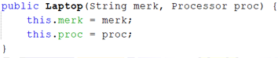
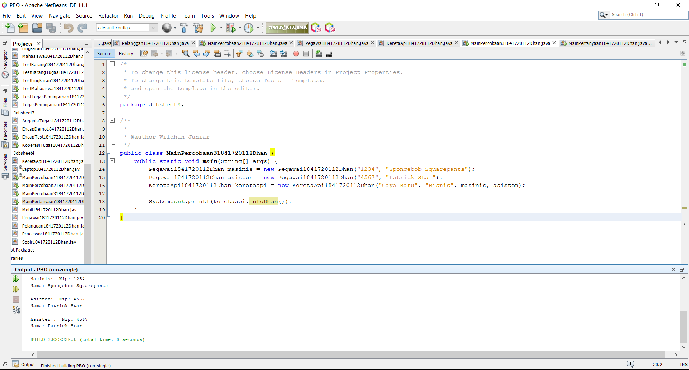

# Laporan Praktikum #4 - Relasi Class

## Kompetensi

Setelah menempuh pokok bahasan ini, mahasiswa mampu:
1. Memahami konsep relasi kelas;
2. Mengimplementasikan relasi has‑a dalam program.

## Ringkasan Materi

Mempelajari tentang relasi class dimana 2 class atau lebih memiliki hubungan has-a.

## Percobaan

### Percobaan 1

Membuat class processor

Link kode program : [ini link ke kode program](../../src/4_Relasi_Class/Motor1841720112Dhan.java)

Membuat class laptop

Link kode program : [ini link ke kode program](../../src/4_Relasi_Class/Motor1841720112Dhan.java)

Membuat class main

Link kode program : [ini link ke kode program](../../src/4_Relasi_Class/Motor1841720112Dhan.java)

## Pertanyaan

Berdasarkan percobaan 1, jawablah pertanyaan‑pertanyaan yang terkait:
1. Di dalam class Processor dan class Laptop , terdapat method setter dan getter untuk masing‑masing atributnya. Apakah gunanya method setter dan getter tersebut ?

    Jawab: fungsinya sesuai dengan namanya yaitu untu melakukan set (memberi nilai) dan melakukan get (mendapatkan/melihat nilai) pada suatu variabel atau class dengan contructor default

2. Di dalam class Processor dan class Laptop, masing‑masing terdapat konstruktor default dan konstruktor berparameter. Bagaimanakah beda penggunaan dari kedua jenis konstruktor tersebut ?

    Jawab: bila konstruktor default, untuk memberi nilai menggunakan setter, tetapi jika kita menggunakan konstruktor berparameter, kita hanya perlu memberi nilai di parameter pada objek di class main.

3. Perhatikan class Laptop, di antara 2 atribut yang dimiliki (merk dan proc), atribut manakah yang bertipe object ?

    Jawab: yang bertipe objek adalah proc, karena inisiasi tipe variabel ditandai dengan nama object.

4. Perhatikan class Laptop, pada baris manakah yang menunjukan bahwa class Laptop memiliki relasi dengan class Processor ?

    Jawab: pada constructor, terdapat parameter yang menggunakan object Processor yang telah diinisiasi sebelumnya.
    

5. Perhatikan pada class Laptop , Apakah guna dari sintaks proc.info() ?

    Jawab: proc.Info(), merupakan syntax yang digunakan untuk menjalankan method Info() pada class Processor.

6. Pada class MainPercobaan1, terdapat baris kode:
Laptop l = new Laptop("Thinkpad", p);.
Apakah p tersebut ?
Dan apakah yang terjadi jika baris kode tersebut diubah menjadi:
Laptop l = new Laptop("Thinkpad", new Processor("Intel i5",
3)); Bagaimanakah hasil program saat dijalankan, apakah ada perubahan ?

    Jawab: p merupakan object dari class Processor yang tadi telah diinstansiasi, Lalu kode program yang baru hasilnya sama saja, kode program tersebut memiliki perbedaan pada instansiasi dalam bentuk variabel object, bila pada kode program tersebut object tidak perlu diinstansiasi kedalam variabel lain tetapi ter nested atau bisa dibilang melakukan instansiasi objek dialam instansiasi object.

### Percobaan 2

Membuat class mobil

Link kode program : [ini link ke kode program](../../src/4_Relasi_Class/Motor1841720112Dhan.java)

membuat class sopir

Link kode program : [ini link ke kode program](../../src/4_Relasi_Class/Motor1841720112Dhan.java)

Membuat class pelanggan

Link kode program : [ini link ke kode program](../../src/4_Relasi_Class/Motor1841720112Dhan.java)

Membuat claas main

Link kode program : [ini link ke kode program](../../src/4_Relasi_Class/Motor1841720112Dhan.java)

## Pertanyaan

1. Perhatikan class Pelanggan. Pada baris program manakah yang menunjukan bahwa class Pelanggan memiliki relasi dengan class Mobil dan class Sopir ?

    Jawab: Dapat dilihat pada inisiasi  variabel object di class pelanggan
    

2. Perhatikan method hitungBiayaSopir pada class Sopir, serta method hitungBiayaMobil pada class Mobil. Mengapa menurut Anda method tersebut harus memiliki argument hari ?

    Jawab: argumen tersebut nantinya digunakan untuk diisi dengan variabel int hari pada class Pelanggan

3. Perhatikan kode dari class Pelanggan. Untuk apakah perintah
mobil.hitungBiayaMobil(hari) dan sopir.hitungBiayaSopir(hari) ?

    Jawab: kode program tersebut digunakan untuk menjumlahkan biaya mobil yang diambil dari harga sopir dikali dengan hari lalu yang dijumlahkan dengan biaya sopir yang diambil dari harga sopir dikali hari.

4. Perhatikan class MainPercobaan2. Untuk apakah sintaks p.setMobil(m) dan p.setSopir(s) ?

    Jawab: kode program tersebut digunakan untuk memberi atau mengisi nilai dari namaMobil dan namaSopir yang ada pada objek pelanggan

5. Perhatikan class MainPercobaan2. Untuk apakah proses p.hitungBiayaTotal() tersebut ?

    Jawab: Digunakan untuk menghitung biaya total dari penjumlahan antara biaya sopir dan biaya mobil.

6. Perhatikan class MainPercobaan2, coba tambahkan pada baris terakhir dari method main dan amati perubahan saat di‑run!
System.out.println(p.getMobil().getMerk());
Jadi untuk apakah sintaks p.getMobil().getMerk() yang ada di dalam method main tersebut?

    Jawab: perintah tersebut digunakan untuk menggembalikan atau me return nilai atribut dari method  getMerk() pada class Mobil melalui objek pelanggan, atau setelah me return object Mobil pada class pelanggan, object mobil akan me return String getMerk() pada class mobil

### Percobaan 3

Membuat class pegawai

Link kode program : [ini link ke kode program](../../src/4_Relasi_Class/Motor1841720112Dhan.java)

Membuat class kereta api

Link kode program : [ini link ke kode program](../../src/4_Relasi_Class/Motor1841720112Dhan.java) *kode program sudah saya ubah dengan ketentuan pertanyaan nomor 4, program yang asli seperti pada screenshot diatas

Membuat main class

Link kode program : [ini link ke kode program](../../src/4_Relasi_Class/Motor1841720112Dhan.java)

## Pertanyaan

1. Di dalam method info() pada class KeretaApi, baris this.masinis.info() dan this.asisten.info() digunakan untuk apa ?

    Jawab: digunakan untuk memanggil method Info yang berada di class Pegawai melalui object masinis dan asisten

2. Buatlah main program baru dengan nama class MainPertanyaan pada package yang sama. Tambahkan kode berikut pada method main() !
Pegawai masinis = new Pegawai("1234", "Spongebob Squarepants");
KeretaApi keretaApi = new KeretaApi("Gaya Baru", "Bisnis",
masinis); System.out.println(keretaApi.info());

    Jawab: 

3. Apa hasil output dari main program tersebut ? Mengapa hal tersebut dapat terjadi ?

    Jawab: 
    terjadi karane ada variabel yang tidak bernilai atau disebut dengan null, dan variabel tersebut adalah object asisten pada class KeretaApi

4. Perbaiki class KeretaApi sehingga program dapat berjalan !

    Jawab: memperbaiki class kereta api
    
    hasilnya
    

### Percobaan 4

Membuat class penumpang

Link kode program : [ini link ke kode program](../../src/4_Relasi_Class/Motor1841720112Dhan.java)

membuat class kursi

Link kode program : [ini link ke kode program](../../src/4_Relasi_Class/Motor1841720112Dhan.java)

Membuat class gerbong

Link kode program : [ini link ke kode program](../../src/4_Relasi_Class/Motor1841720112Dhan.java)*kode program sudah saya ubah dengan ketentuan pertanyaan nomor 5, program yang asli seperti pada screenshot diatas

Membuat claas main

Link kode program : [ini link ke kode program](../../src/4_Relasi_Class/Motor1841720112Dhan.java)*kode program sudah saya ubah dengan ketentuan pertanyaan nomor 4, program yang asli seperti pada screenshot diatas

## Pertanyaan

1. Pada main program dalam class MainPercobaan4, berapakah jumlah kursi dalam Gerbong A ?

    Jawab: 10, pada instansiasi new Gerbong atau bisa dilihat pada output perulangan “Nomer : 10” 

2. Perhatikan potongan kode pada method info() dalam class Kursi. Apa maksud kode tersebut ?
...
if (this.penumpang != null) {
info += "Penumpang: " + penumpang.info() + "\n";
}
...

    Jawab: potongan kode program tersebut digunakan untuk menampilkan kursi yang terisi oleh penumpang, tetapi bila penumpang tidak memiliki nilai atau null, maka kode program yang terdapat pada if tidak dijalankan dimana itu berarti kursi tersebut masih kosong

3. Mengapa pada method setPenumpang() dalam class Gerbong, nilai nomor dikurangi dengan angka 1 ?

    Jawab: karena index array selalu dimulai dari 0, karena itu nilai nomer harus dikurangi 1 agar array di index 0 atau di index pertama dapat terisi

4. Instansiasi objek baru budi dengan tipe Penumpang, kemudian masukkan objek baru tersebut pada gerbong dengan gerbong.setPenumpang(budi, 1). Apakah yang terjadi ?

    Jawab: 
    akan muncul seperti pada gambar di atas, dimana kursi 1 menjadi milik budi

5. Modifikasi program sehingga tidak diperkenankan untuk menduduki kursi yang sudah ada penumpang lain !

    Jawab: 
    hasilnya
    

## Tugas

Link kode program : [ini link ke kode program](../../src/4_Relasi_Class/Motor1841720112Dhan.java)

Link kode program : [ini link ke kode program](../../src/4_Relasi_Class/Motor1841720112Dhan.java)

## Kesimpulan

Ada dua jenis relasi secara umum dalam Object Oriented Programming (OOP), yaitu jenis Has-A, dan jenis Is-A. Relasi Has-A antara objek 1 dan 2 dapat diartikan sebagai objek 1 memiliki objek 2. Sedangkan relasi Is-A antara objek 3 dan 4 dapat diartikan sebagai objek 3 adalah objek 4. Relasi ini dikenal juga sebagai bentuk pewarisan (inheritance).  

## Pernyataan Diri

Saya menyatakan isi tugas, kode program, dan laporan praktikum ini dibuat oleh saya sendiri. Saya tidak melakukan plagiasi, kecurangan, menyalin/menggandakan milik orang lain.

Jika saya melakukan plagiasi, kecurangan, atau melanggar hak kekayaan intelektual, saya siap untuk mendapat sanksi atau hukuman sesuai peraturan perundang-undangan yang berlaku.

Ttd,

Muhammad Wildhan Juniar Diharja Sardhany