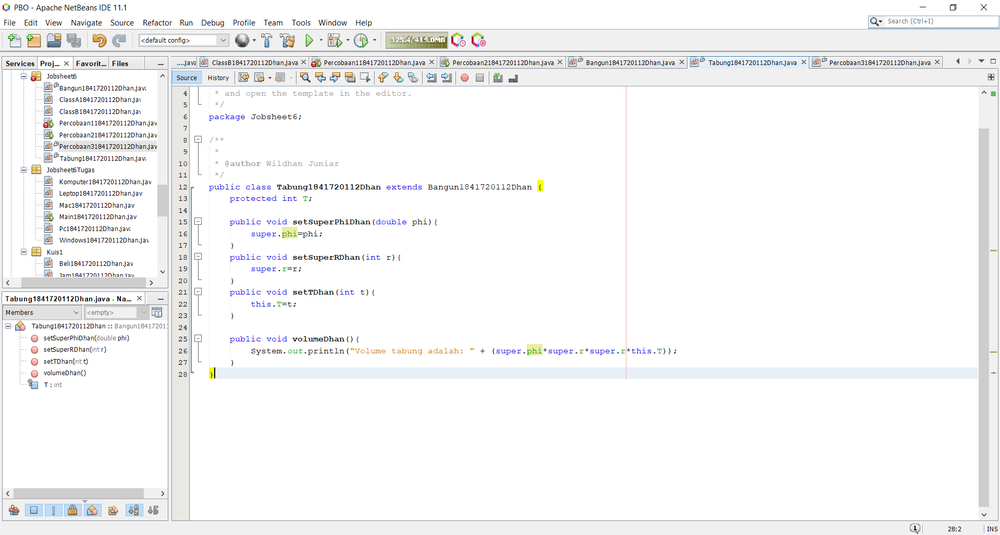
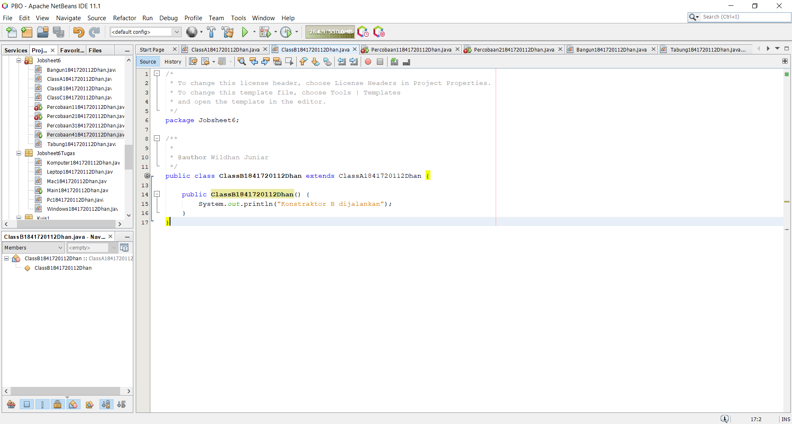

# Laporan Praktikum #6 - INHERITANCE

## Kompetensi

Setelah menempuh pokok bahasan ini, mahasiswa mampu:
1. Memahami konsep dasar inheritance atau pewarisan.
2. Mampu membuat suatu subclass dari suatu superclass tertentu.
3. Mampu mengimplementasikan konsep single dan multilevel inheritance.
4. Mampu membuat objek dari suatu subclass dan melakukan pengaksesan terhadap atribut dan method baik yang dimiliki sendiri atau turunan dari superclass nya.

## Ringkasan Materi

Mempelajari tentang Extends, Hak Akses, Super, Super contsructor, Single Inheritance, Multilevel inheritance

## Percobaan

### Percobaan 1

Membuat classA


Link kode program : [ini link ke kode program](../../src/6_Inheritance/ClassA1841720112Dhan.java) #Kode program sudah saya ubah berdasarkan ketentuan selanjutnya, kode program yang asli seperti pada screenshot di atas

Membuat classB


Link kode program : [ini link ke kode program](../../src/6_Inheritance/ClassB1841720112Dhan.java) #Kode program sudah saya ubah berdasarkan ketentuan selanjutnya, kode program yang asli seperti pada screenshot di atas

Membuat class Percobaan1


Link kode program : [ini link ke kode program](../../src/6_Inheritance/Percobaan11841720112Dhan.java)

## Pertanyaan

1. Pada percobaan 1 diatas program yang dijalankan terjadi error, kemudian perbaiki sehingga program tersebut bisa dijalankan dan tidak error!

    Jawab: Disini saya mengubah classB dengan menambahkan extends
    menjadi seperti pada screenshot di bawah ini dan hasilnya dapat muncul.
    

2. Jelaskan apa penyebab program pada percobaan 1 ketika dijalankan terdapat error!

    Jawab: Karena Program class child B belum diextends ke class parent A.


### Percobaan 2

Membuat classA


Link kode program : [ini link ke kode program](../../src/6_Inheritance/ClassA1841720112Dhan.java) #Kode program sudah saya ubah berdasarkan ketentuan selanjutnya, kode program yang asli seperti pada screenshot di atas

Membuat classB


Link kode program : [ini link ke kode program](../../src/6_Inheritance/ClassB1841720112Dhan.java) #Kode program sudah saya ubah berdasarkan ketentuan selanjutnya, kode program yang asli seperti pada screenshot di atas

Membuat class Percobaan2


Link kode program : [ini link ke kode program](../../src/6_Inheritance/Percobaan21841720112Dhan.java)

## Pertanyaan

1. Pada percobaan 2 diatas program yang dijalankan terjadi error, kemudian perbaiki sehingga program tersebut bisa dijalankan dan tidak error!

    Jawab: Disini saya mengubah classA dan B menjadi seperti pada screenshot dibawah dan hasilnya berhasil muncul
    
    

2. Jelaskan apa penyebab program pada percobaan 2 ketika dijalankan terdapat error!

    Jawab: Karena Program class child B belum diextends ke class parent A dan dan pada class A modifiernya private, dimana private hanya bisa diakses jika satu class dan tidak bisa diakses di kelas lain.


### Percobaan 3

Membuat class Bangun


Link kode program : [ini link ke kode program](../../src/6_Inheritance/Bangun1841720112Dhan.java)

Membuat Tabung


Link kode program : [ini link ke kode program](../../src/6_Inheritance/Tabung1841720112Dhan.java)

Membuat class Percobaan3


Link kode program : [ini link ke kode program](../../src/6_Inheritance/Percobaan31841720112Dhan.java)

## Pertanyaan

1. Jelaskan fungsi “super” pada potongan program berikut di class Tabung!

    Jawab: Super tersebut berfungsi untuk memanggil atribut dari class parent. Dimana atribut phi dan r tersebut berorientasi pada phi dan r pada class paarent.


2. Jelaskan fungsi “super” dan “this” pada potongan program berikut di class Tabung!

    Jawab: Super untuk memanggil atribut pada class parent dan this untuk memanggil atribut yang telah ditentukan untuk menghindari dari penamaan atribut yang sama. dalam program diatas phi dan r berorieantasi pada atribut class parent jadi phi dan r menggunakan super, sedangkan t menggunakan this untuk memanggil atribut t yang telah ditentukan sebelumnya.

3. Jelaskan mengapa pada class Tabung tidak dideklarasikan atribut “phi” dan “r” tetapi class tersebut dapat mengakses atribut tersebut!

    Jawab: Karena class tabung merupakan turunan dari class bangun oleh karenanya class tabung bisa memanggil atribut dari class bangun dengan cara menggunakan super.


### Percobaan 4

Membuat classA


Link kode program : [ini link ke kode program](../../src/6_Inheritance/ClassA1841720112Dhan.java)

Membuat classB


Link kode program : [ini link ke kode program](../../src/6_Inheritance/ClassB1841720112Dhan.java)

Membuat classC


Link kode program : [ini link ke kode program](../../src/6_Inheritance/ClassC1841720112Dhan.java)

Membuat class Percobaan4


Link kode program : [ini link ke kode program](../../src/6_Inheritance/Percobaan41841720112Dhan.java)

## Pertanyaan

1. Pada percobaan 4 sebutkan mana class yang termasuk superclass dan subclass, kemudian jelaskan alasannya!

    Jawab:  ClassA = Superclass dari classB, ClassB = SubClass dari classA, ClassB = Superclass dari classC, ClassC = SubClass dari classB

2. Ubahlah isi konstruktor default ClassC seperti berikut:
```java
public class ClassC extends ClassB {
    ClassC() {
        super();
        System.out.println("konstruktor C dijalankan");
    }
}
```
Tambahkan kata super() di baris Pertaman dalam konstruktor defaultnya. Coba jalankan kembali class Percobaan4 dan terlihat tidak ada perbedaan dari hasil outputnya!

Jawab:

3. Ketika mengubah posisi super() dibaris kedua dalam kontruktor defaultnya dan terlihat ada error. Kemudian kembalikan super() kebaris pertama seperti sebelumnya, maka errornya akan hilang. Perhatikan hasil keluaran ketika class Percobaan4 dijalankan. Kenapa bisa tampil output seperti berikut pada saat instansiasi objek test dari class ClassC

    Jawab: karena pada constraktor classB terdapat syntax super(); maka constraktor dari superclass akan dipanggil.

4. Apakah fungsi super() pada potongan program dibawah ini di ClassC!

    Jawab: Untuk memanggil constraktor pada superclass

### Percobaan 5

Membuat class Karyawan


Link kode program : [ini link ke kode program](../../src/6_Inheritance/Karyawan1841720112Dhan.java)

Membuat class Manager


Link kode program : [ini link ke kode program](../../src/6_Inheritance/Manager1841720112Dhan.java)

Membuat class Staff


Link kode program : [ini link ke kode program](../../src/6_Inheritance/Staff1841720112Dhan.java)

Membuat class Inheritance1


Link kode program : [ini link ke kode program](../../src/6_Inheritance/Inheritance11841720112Dhan.java) #kode program sudah saya ubah berdasarkan percobaan 6, kode program asli seperti pada screenshot di atas

## Pertanyaan

1. Sebutkan class mana yang termasuk super class dan sub class dari percobaan 1 diatas!

    Jawab:  class karyawan merupakan superclass dari class manager dan staff, class manager merupakan subclass dari class karyawan, class staff merupakan subclass dari class karyawan.

2. Kata kunci apakah yang digunakan untuk menurunkan suatu class ke class yang lain?

    Jawab: Kata kuncinya adalah extends

3. Perhatikan kode program pada class Manager, atribut apa saja yang dimiliki oleh class tersebut? Sebutkan atribut mana saja yang diwarisi dari class Karyawan!

    Jawab: class Manager mempunyai atribut tunjangan. atribut nama,alamat,jk,umur,gaji merupakan warisan dari class karyawan

4. Jelaskan kata kunci super pada potongan program dibawah ini yang terdapat pada class Manager!

    Jawab: super tersebut untuk memanggil atribut gaji pada class parent yaitu class karyawan.

5. Program pada percobaan 5 diatas termasuk dalam jenis inheritance apa? Jelaskan alasannya!

    Jawab: program diatas merupakan jenis Single Inheritance. karena class Manager dan staff tidak memiliki subclass.

### Percobaan 6

Membuat class Karyawan


Link kode program : [ini link ke kode program](../../src/6_Inheritance/Karyawan1841720112Dhan.java)

Membuat class Manager


Link kode program : [ini link ke kode program](../../src/6_Inheritance/Manager1841720112Dhan.java)

Membuat class Staff


Link kode program : [ini link ke kode program](../../src/6_Inheritance/Staff1841720112Dhan.java)

Membuat class StaffTetap


Link kode program : [ini link ke kode program](../../src/6_Inheritance/StaffTetap1841720112Dhan.java)

Membuat class StaffHarian


Link kode program : [ini link ke kode program](../../src/6_Inheritance/StaffHarian1841720112Dhan.java)

Membuat class Inheritance1


Link kode program : [ini link ke kode program](../../src/6_Inheritance/Inheritance11841720112Dhan.java)

## Pertanyaan

1. Berdasarkan class diatas manakah yang termasuk single inheritance dan mana yang termasuk multilevel inheritance?

    Jawab:
    1. single inheritance : class manager karena tidak mempunyai subclass .
    2. multilevel inheritance : class staff karena mempunyai subclass yaitu class stafTetap dan stafHarian.

2. Perhatikan kode program class StaffTetap dan StaffHarian, atribut apa saja yang dimiliki oleh class tersebut? Sebutkan atribut mana saja yang diwarisi dari class Staff!

    Jawab:
    1. class StaffTetap: golongan dan asuransi.
    2. class StaffHarian: jmlJamKerja.
    3. warisan dari class staff: nama,alamat,umur,jk,gaji,lembur,potongan.

3. Apakah fungsi potongan program berikut pada class StaffHarian

    Jawab: untuk memanggil consraktor pada superclass/class staff.

4. Apakah fungsi potongan program berikut pada class StaffHarian

    Jawab: untuk memanggil metode tampilDataStaff pada superclass/class staff

5. Perhatikan kode program dibawah ini yang terdapat pada class StaffTetap 
Terlihat dipotongan program diatas atribut gaji, lembur dan potongan dapat diakses langsung. Kenapa hal ini bisa terjadi dan bagaimana class StaffTetap memiliki atribut gaji, lembur, dan potongan padahal dalam class tersebut tidak dideklarasikan atribut gaji, lembur, dan potongan?

    Jawab: karena atribut merupakan warisan dari superclass


## Tugas

Membuat class Komputer


Link kode program : [ini link ke kode program](../../src/6_Inheritance/Komputer1841720112Dhan.java)

Membuat class Leptop


Link kode program : [ini link ke kode program](../../src/6_Inheritance/Leptop1841720112Dhan.java)

Membuat class Pc


Link kode program : [ini link ke kode program](../../src/6_Inheritance/Pc1841720112Dhan.java)

Membuat class Mac


Link kode program : [ini link ke kode program](../../src/6_Inheritance/Mac1841720112Dhan.java)

Membuat class Windows


Link kode program : [ini link ke kode program](../../src/6_Inheritance/Windows1841720112Dhan.java)

Membuat class main


Link kode program : [ini link ke kode program](../../src/6_Inheritance/Main1841720112Dhan.java)

## Kesimpulan

Inheritance ialah pewarisan yang sering digunakan terdapat dua istilah ialah Class dasar (SuperClass) dan Class turunan (SubClass) dan dalam mendeklarasikan suatu class sebagai subclass dilakukan dengan menambahkan kata kunci (Syntax) extends setelah deklarasi nama class. Diikuti dengan nama superclass/ parentclassnya.

3 bentuk pewarisan:
1. Single inheritance, Multilevel inheritance,dan Multiple inheritance.
2. Single inheritance adalah Suatu Class yang hanya mempunyai satu parent class.
3. Multilevel Inheritance adalah Suatu Subclass bisa menjadi superclass bagi class yang lain.

Macam kata kunci super:

1. Super.namaAtribut : mengakses atribut dari parent class
2. Super.namaMethod(): Memanggil method dari parent class
3. Super() : Memanggil konstruktor parent class yang hanya bisa digunakan dibaris pertama dalam konstruktor.
4. Super(parameter1,paramter2,dst) : Memanggil konstruktor berparameter dari superclass.  

## Pernyataan Diri

Saya menyatakan isi tugas, kode program, dan laporan praktikum ini dibuat oleh saya sendiri. Saya tidak melakukan plagiasi, kecurangan, menyalin/menggandakan milik orang lain.

Jika saya melakukan plagiasi, kecurangan, atau melanggar hak kekayaan intelektual, saya siap untuk mendapat sanksi atau hukuman sesuai peraturan perundang-undangan yang berlaku.

Ttd,

**Muhammad Wildhan Juniar Diharja Sardhany**