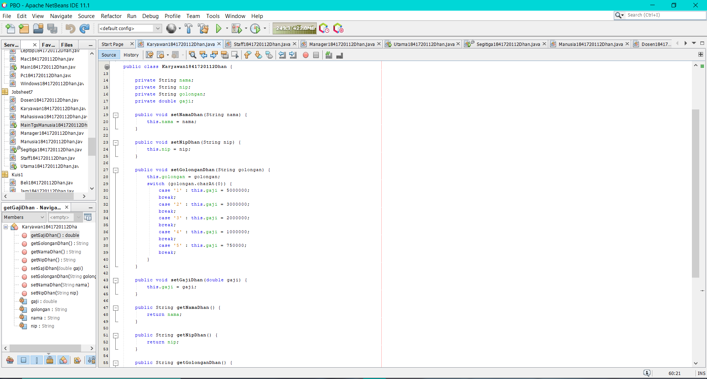
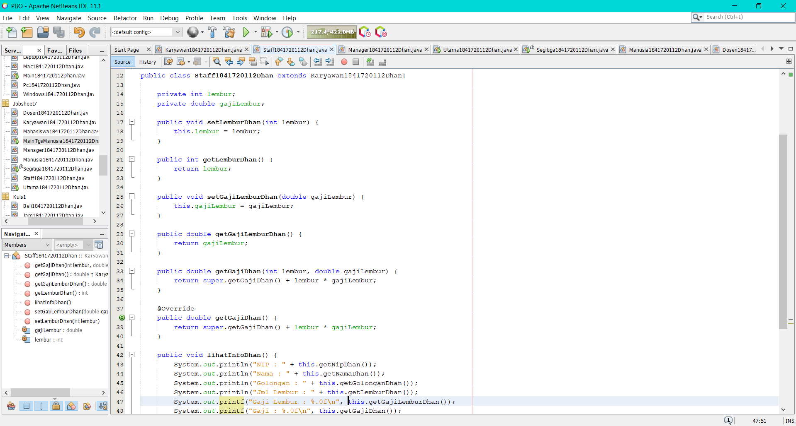
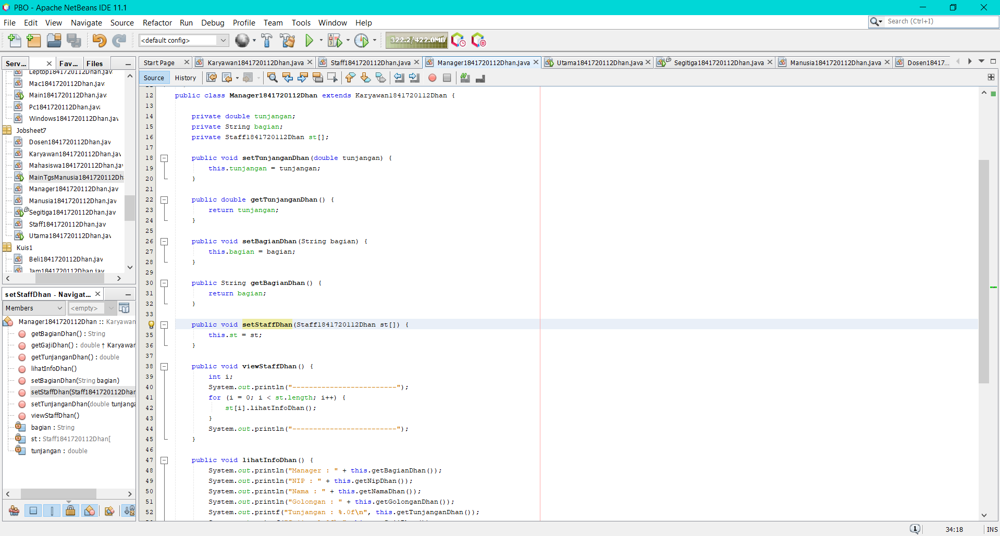
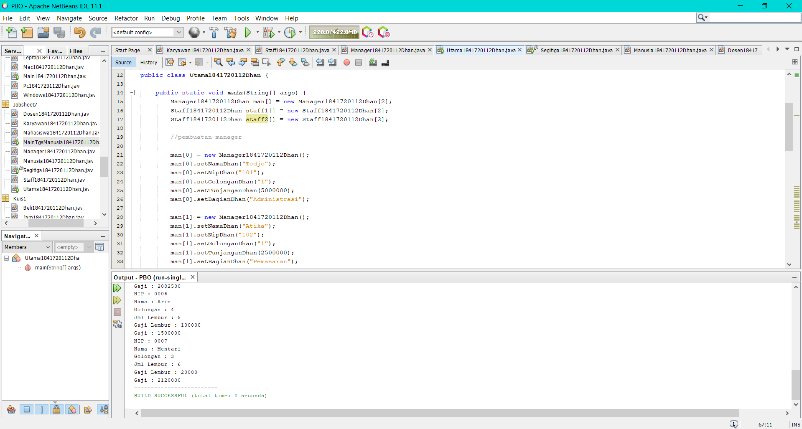
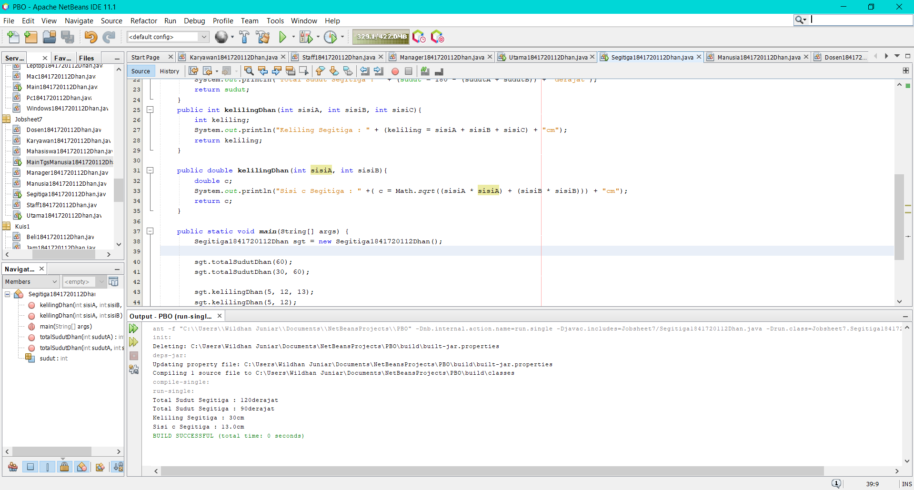
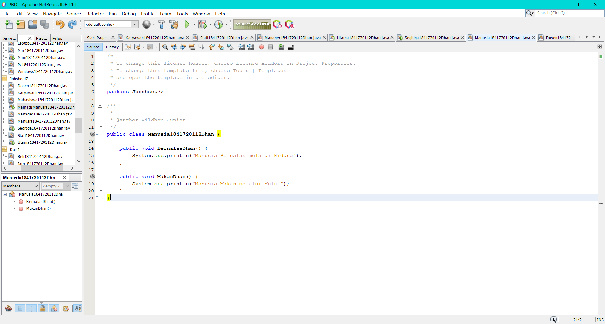
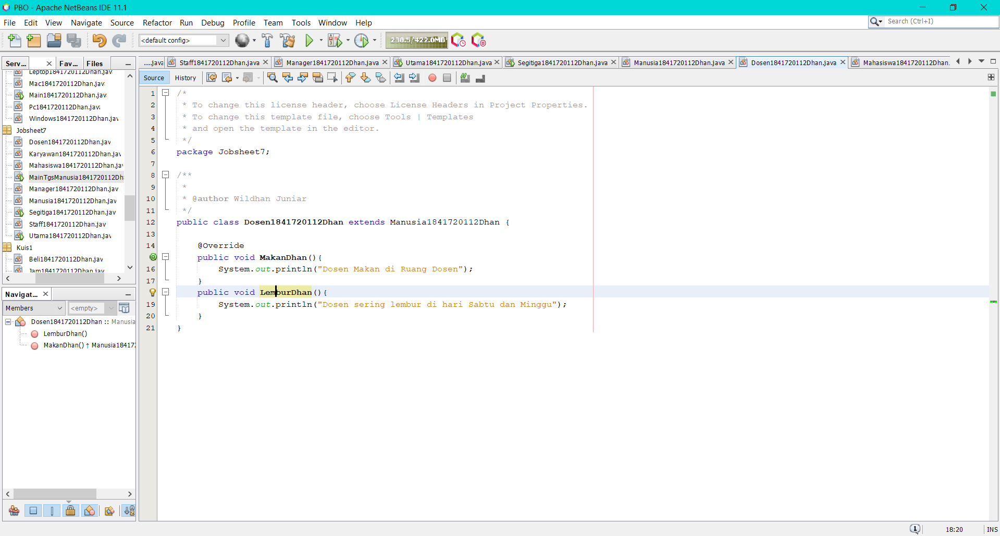
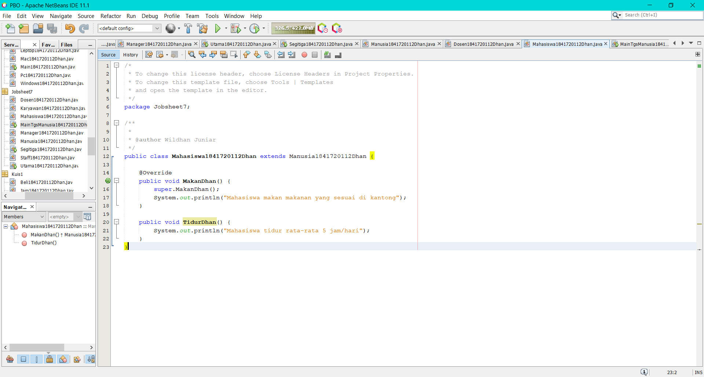
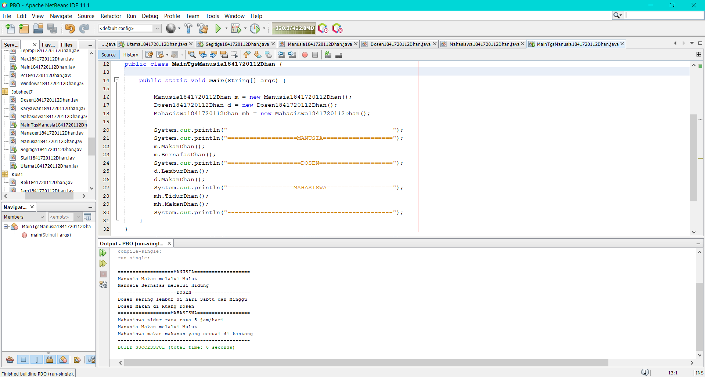

# Laporan Praktikum #7 - OVERRIDING DAN OVERLOADING

## Kompetensi

Setelah menempuh pokok bahasan ini, mahasiswa mampu :
1. Memahami konsep overloading dan overriding,
2. Memahami perbedaan overloading dan overriding,
3. Ketepatan dalam mengidentifikasi method overriding dan overloading
4. Ketepatan dalam mempraktekkan instruksi pada jobsheet
5. Mengimplementasikan method overloading dan overriding.

## Ringkasan Materi

Mempelajari tentang Overriding dan Overloading

## Percobaan

Membuat class Karyawan


Link kode program : [ini link ke kode program](../../src/7_Overriding_dan_Overloading/Karyawan1841720112Dhan.java)

Membuat class Staff


Link kode program : [ini link ke kode program](../../src/7_Overriding_dan_Overloading/Staff1841720112Dhan.java)

Membuat class Manager


Link kode program : [ini link ke kode program](../../src/7_Overriding_dan_Overloading/Manager1841720112Dhan.java)

Membuat class Utama


Link kode program : [ini link ke kode program](../../src/7_Overriding_dan_Overloading/Utama1841720112Dhan.java)


## Pertanyaan

```java
public class PerkalianKu {
    
    void perkalian(int a, int b) {
        System.out.println(a * b);
    }

    void perkalian(int a, int b, int c) {
        System.out.println(a * b * c);
    }

    public static void main(String args []) {
        PerkalianKu objek = new PerkalianKu();

        objek.perkalian(25, 43);
        objek.perkalian(34, 23, 56);
    }
}
```

1. Dari source coding diatas terletak dimanakah overloading?

    Jawab: : Terdapat method overloading yaitu pada
    ```java
    void perkalian(int a, int b, int c) {
        System.out.println(a * b * c);
    }
    ```

2. Jika terdapat overloading ada berapa jumlah parameter yang berbeda?

    Jawab: parameter yang berbeda berjumlah 1 yaitu pada method perkalian yang pertama berparameter (int a, int b). Sedangkan method perkalian yang kedua (overloading) berparameter (int a, int b, int c).

```java
public class PerkalianKu {
    
    void perkalian(int a, int b) {
        System.out.println(a * b);
    }

    void perkalian(double a, double b) {
        System.out.println(a * b);
    }

    public static void main(String args []) {
        PerkalianKu objek = new PerkalianKu();

        objek.perkalian(25, 43);
        objek.perkalian(34.56, 23.7);
    }
}
```

3. Dari source coding diatas terletak dimanakah overloading?

    Jawab: Terdapat method overloading yaitu pada
    ```java
    void perkalian(double a, double b) {
        System.out.println(a * b);
    }
    ```

4. Jika terdapat overloading ada berapa tipe parameter yang berbeda?

    Jawab: ada 1 tipe parameter berbeda, method pertama menggunakan tipe parameter integer (int), sedangkan pada method kedua (overloading) menggunakan tipe parameter double, meskipun jumlah parameternya sama yaitu 2.

```java
class Ikan {
    public void swim() {
        System.out.println("Ikan bisa berenang");
    }
}

class Piranha extends Ikan {
    public void swim() {
        System.out.println("Piranha bisa makan daging");
    }
}

public class Fish {

    public static void main(String[] args) {
    
        Ikan a = new Ikan();
        Ikan b = new Piranha();

        a.swim();
        b.swim();
    }
}
```

5. Dari source coding diatas terletak dimanakah overriding?

    Jawab: terletak pada method swim() di class Piranha
    ```java
    public void swim() {
        System.out.println("Piranha bisa makan daging");
    }
    ```

6. Jabarkanlah apabila sourcoding diatas jika terdapat overriding?

    Jawab: Terdapat overriding pada method swim() di class Piranha. Disebut method overriding dikarenakan nama method tersebut sama dengan nama method di superclassnya, namun berbeda di isi methodnya (dimodifikasi).


## Tugas

### Tugas 1
Membuat class Segitiga yang terdapat fungsi main didalamnya


Link kode program : [ini link ke kode program](../../src/7_Overriding_dan_Overloading/Segitiga1841720112Dhan.java)

### Tugas 2
Membuat class Manusia


Link kode program : [ini link ke kode program](../../src/7_Overriding_dan_Overloading/Manusia1841720112Dhan.java)

Membuat class Dosen


Link kode program : [ini link ke kode program](../../src/7_Overriding_dan_Overloading/Dosen1841720112Dhan.java)

Membuat class Mahasiswa


Link kode program : [ini link ke kode program](../../src/7_Overriding_dan_Overloading/Mahasiswa1841720112Dhan.java)

Membuat class MainTgsManusia


Link kode program : [ini link ke kode program](../../src/7_Overriding_dan_Overloading/MainTgsManusia1841720112Dhan.java)

## Kesimpulan

Suatu project dapat menuliskan kembali method dengan nama yang sama pada suatu class. Tujuannya agar memudahkan penggunaan / pemanggilan method dengan fungsionalitas yang mirip. Hal tersebut dinamakan overloading. Overloading juga bisa terjadi antara parent class dengan subclass-nya jika memenuhi ketiga syarat overload. Adapun Overriding adalah Sublass yang berusaha memodifkasi tingkah laku yang diwarisi dari superclass. Tujuannya subclass dapat memiliki tingkah laku yang lebih spesifik sehingga dapat dilakukan dengan cara mendeklarasikan kembali method milik parent class di subclass.

## Pernyataan Diri

Saya menyatakan isi tugas, kode program, dan laporan praktikum ini dibuat oleh saya sendiri. Saya tidak melakukan plagiasi, kecurangan, menyalin/menggandakan milik orang lain.

Jika saya melakukan plagiasi, kecurangan, atau melanggar hak kekayaan intelektual, saya siap untuk mendapat sanksi atau hukuman sesuai peraturan perundang-undangan yang berlaku.

Ttd,

**Muhammad Wildhan Juniar Diharja Sardhany**