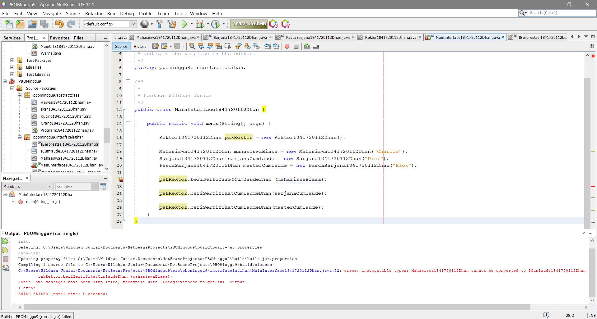
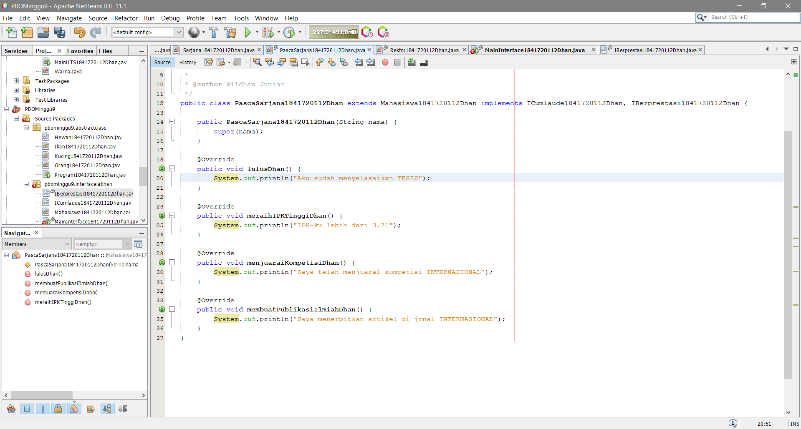

# Laporan Praktikum #7 - OVERRIDING DAN OVERLOADING

## Kompetensi

Setelah menyelesaikan lembar kerja ini mahasiswa diharapkan mampu:
1. Menjelaskan maksud dan tujuan penggunaan Abstract Class;
2. Menjelaskan maksud dan tujuan penggunaan Interface;
3. Menerapkan Abstract Class dan Interface di dalam pembuatan program.

## Ringkasan Materi

Mempelajari tentang Abstract Class dan Interface

## Percobaan Abstract Class

Membuat class hewan

Link kode program : [ini link ke kode program](../../src/9_Abstract_Class_dan_Interface/Hewan1841720112Dhan.java)

Membuat class kucing

Link kode program : [ini link ke kode program](../../src/9_Abstract_Class_dan_Interface/Kucing1841720112Dhan.java)

Membuat class ikan

Link kode program : [ini link ke kode program](../../src/9_Abstract_Class_dan_Interface/Ikan1841720112Dhan.java)

Membuat class orang

Link kode program : [ini link ke kode program](../../src/9_Abstract_Class_dan_Interface/Orang1841720112Dhan.java)

Membuat class main program

Link kode program : [ini link ke kode program](../../src/9_Abstract_Class_dan_Interface/Program1841720112Dhan.java)

## Pertanyaan Diskusi

Bolehkah apabila sebuah class yang meng-extend suatu abstract class tidak mengimplementasikan method abstract yang ada di class induknya? Buktikan!

    Jawab: Tidak boleh, class yang meng-extend abstract class harus mengimplementasikan method abstractnya, kalau tidak akan muncul tanda merah di sebelah kiri yang berisi perintah untuk mengimplementasi method abstract

## Percobaan Interface

Membuat interface ICumlaude

Link kode program : [ini link ke kode program](../../src/9_Abstract_Class_dan_Interface/ICumlaude1841720112Dhan.java)

Membuat class Mahasiswa

Link kode program : [ini link ke kode program](../../src/9_Abstract_Class_dan_Interface/Mahasiswa1841720112Dhan.java)

Membuat class Sarjana

Link kode program : [ini link ke kode program](../../src/9_Abstract_Class_dan_Interface/Sarjana1841720112Dhan.java)

Membuat class PascaSarjana

Link kode program : [ini link ke kode program](../../src/9_Abstract_Class_dan_Interface/PascaSarjana1841720112Dhan.java)

Membuat class Rektor

Link kode program : [ini link ke kode program](../../src/9_Abstract_Class_dan_Interface/Rektor1841720112Dhan.java)

Membuat class main program

Membuat class main program agar berjalan sesuai ketentuan

Link kode program : [ini link ke kode program](../../src/9_Abstract_Class_dan_Interface/MainInterface1841720112Dhan.java)

## Pertanyaan Diskusi

a. Mengapa pada langkah nomor 9 terjadi error? Jelaskan!

    Jawab: Karena pada class mahasiswa tidak diimplementasikan dari class interface yaitu class ICumlaude

b. Dapatkah method kuliahDiKampus() dipanggil dari objek sarjanaCumlaude di class Program? Mengapa demikian?

    Jawab: Bisa karena class sarjana merupakan sub class dari class mahasiswa

c. Dapatkah method kuliahDiKampus() dipanggil dari parameter mahasiswa di method beriSertifikatCumlaude() pada class Rektor? Mengapa demikian?

    Jawab: Tidak bisa, karena method kuliahDiKampus berada di class Mahasiswa, dimana belum di implementasikan ke class interface. Sedangkan parameter mahasiswa di method berSertifikatCumlaude() bertipe data ICumlaude(interface)

d. Modifikasilah method beriSertifikatCumlaude() pada class Rektor agar hasil eksekusi class Program menjadi seperti berikut ini: 

    Jawab:

## Percobaan Multiple Interfaces Implementation

Membuat interface IBerprestasi

Link kode program : [ini link ke kode program](../../src/9_Abstract_Class_dan_Interface/IBerprestasi1841720112Dhan.java)

Memodifikasi class PascaSarjana

Link kode program : [ini link ke kode program](../../src/9_Abstract_Class_dan_Interface/PascaSarjana1841720112Dhan.java)

Memodifikasi class Rektor

Link kode program : [ini link ke kode program](../../src/9_Abstract_Class_dan_Interface/Rektor1841720112Dhan.java)

Memodifikasi class main program

Membuat class main program agar berjalan sesuai ketentuan

Link kode program : [ini link ke kode program](../../src/9_Abstract_Class_dan_Interface/MainInterface1841720112Dhan.java)

## Pertanyaan Diskusi

Apabila Sarjana Berprestasi harus menjuarai kompetisi NASIONAL dan menerbitkan artikel di jurnal NASIONAL, maka modifikasilah class-class yang terkait pada aplikasi Anda agar di class Program objek pakRektor dapat memberikan sertifikat mawapres pada objek sarjanaCumlaude.

    Jawab: 

## Kesimpulan

Abstract merupakan class yang tidak dapat diinstansiasi namun dapat diextend. Abstract class baru dapat dimanfaatkan ketika di-extend. Sedangkan Interface adalah struktur data yang hanya berisi abstract methods. Tidak ada apa-apa selain method abstract pada interface, termasuk atribut getter dan setter.

## Pernyataan Diri

Saya menyatakan isi tugas, kode program, dan laporan praktikum ini dibuat oleh saya sendiri. Saya tidak melakukan plagiasi, kecurangan, menyalin/menggandakan milik orang lain.

Jika saya melakukan plagiasi, kecurangan, atau melanggar hak kekayaan intelektual, saya siap untuk mendapat sanksi atau hukuman sesuai peraturan perundang-undangan yang berlaku.

Ttd,

**Muhammad Wildhan Juniar Diharja Sardhany**